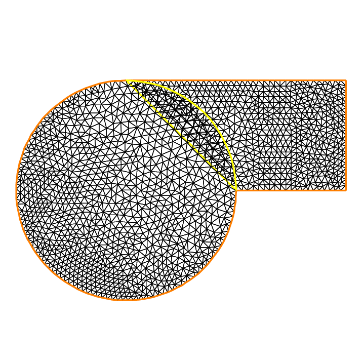
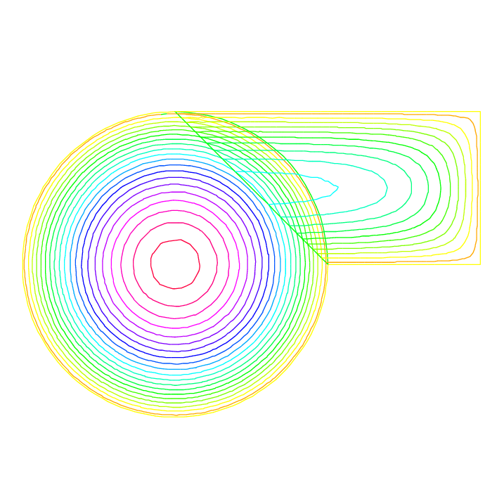
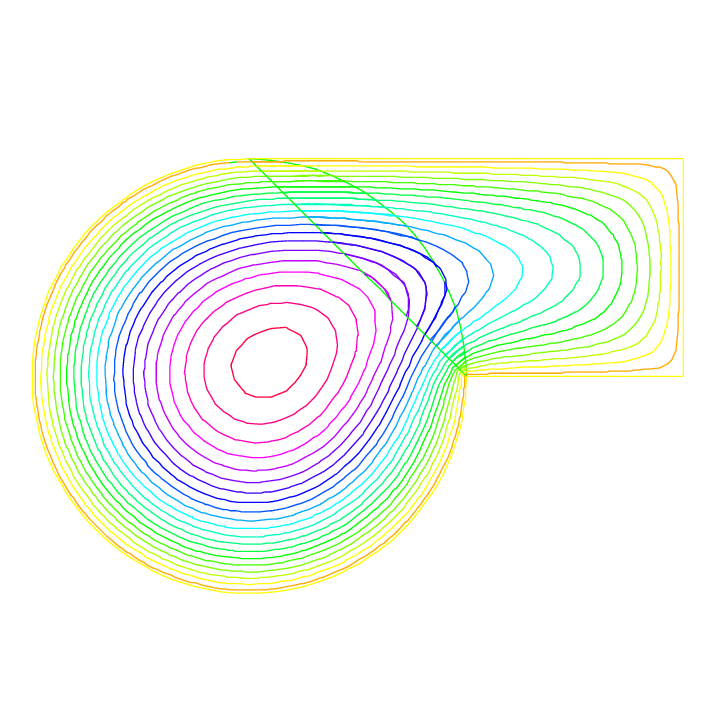
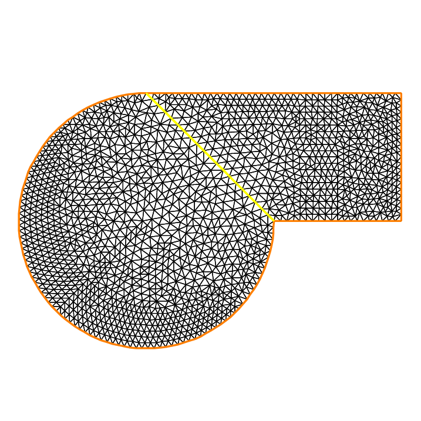
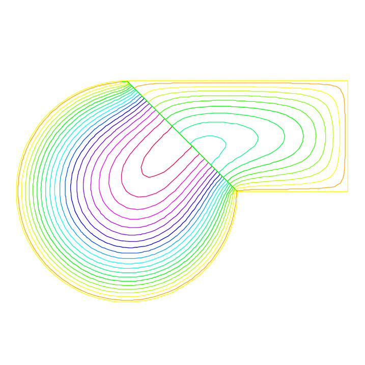

We present three classic examples of domain decomposition technique: first, Schwarz algorithm with overlapping, second Schwarz algorithm without overlapping (also call Shur complement), and last we show to use the conjugate gradient to solve the boundary problem of the Shur complement.

## Schwarz overlapping

To solve

$$
-\Delta u =f,\;\mbox{in}\;\Omega=\Omega_1\cup\Omega_2\quad u|_\Gamma=0
$$

<!--- __ --->

the Schwarz algorithm runs like this

\begin{eqnarray*}
	-\Delta u^{n+1}_1&=&f\;\mbox{in}\;\Omega_1\quad
	u^{n+1}_1|_{\Gamma_1}=u^n_2\\
	-\Delta u^{n+1}_2&=&f\;\mbox{in}\;\Omega_2\quad
	u^{n+1}_2|_{\Gamma_2}=u^n_1
\end{eqnarray*}

where $\Gamma_i$ is the boundary of $\Omega_i$ and on the condition that $\Omega_1\cap\Omega_2\neq\emptyset$ and that $u_i$ are zero at iteration 1.

Here we take $\Omega_1$ to be a quadrangle, $\Omega_2$ a disk and we apply the algorithm starting from zero.

|<a name="Fig25">Fig. 25</a>: The 2 overlapping mesh `:::freefem TH` and `:::freefem th`|
|:----:|
||

!!!example "Schwarz overlapping"
	```freefem
	// Parameters
	int inside = 2; //inside boundary
	int outside = 1; //outside boundary
	int n = 4;

	// Mesh
	border a(t=1, 2){x=t; y=0; label=outside;}
	border b(t=0, 1){x=2; y=t; label=outside;}
	border c(t=2, 0){x=t; y=1; label=outside;}
	border d(t=1, 0){x=1-t; y=t; label=inside;}
	border e(t=0, pi/2){x=cos(t); y=sin(t); label=inside;}
	border e1(t=pi/2, 2*pi){x=cos(t); y=sin(t); label=outside;}
	mesh th = buildmesh(a(5*n) + b(5*n) + c(10*n) + d(5*n));
	mesh TH = buildmesh(e(5*n) + e1(25*n));
	plot(th, TH, wait=true); //to see the 2 meshes

	// Fespace
	fespace vh(th, P1);
	vh u=0, v;

	fespace VH(TH, P1);
	VH U, V;

	// Problem
	int i = 0;
	problem PB (U, V, init=i, solver=Cholesky)
		= int2d(TH)(
			  dx(U)*dx(V)
			+ dy(U)*dy(V)
		)
		+ int2d(TH)(
			- V
		)
		+ on(inside, U=u)
		+ on(outside, U=0)
		;

	problem pb (u, v, init=i, solver=Cholesky)
		= int2d(th)(
			  dx(u)*dx(v)
			+ dy(u)*dy(v)
		)
		+ int2d(th)(
			- v
		)
		+ on(inside, u=U)
		+ on(outside, u=0)
		;

	// Calculation loop
	for (i = 0 ; i < 10; i++){
		// Solve
		PB;
		pb;

		// Plot
		plot(U, u, wait=true);
	}
	```

	|<a name="Fig26">Fig. 26</a>: Isovalues of the solution at iteration 0 and iteration 9|
	|:----:|
	||
	||

## Schwarz non overlapping Scheme

To solve

$$
-\Delta u =f\;\mbox{in}\;\Omega=\Omega_1\cup\Omega_2\quad u|_\Gamma=0
$$

<!--- __ --->

the Schwarz algorithm for domain decomposition without overlapping runs like this

|<a name="Fig27">Fig. 27</a>: The two none overlapping mesh `:::freefem TH` and `:::freefem th`|
|:----:|
||

Let introduce $\Gamma_i$ is common the boundary of $\Omega_1$ and $\Omega_2$ and $\Gamma_e^i= \p \Omega_i \setminus \Gamma_i$.

The problem find $\lambda$ such that $(u_1|_{\Gamma_i}=u_2|_{\Gamma_i})$ where $u_i$ is solution of the following Laplace problem:

$$
	-\Delta u_i=f\;\mbox{in}\;\Omega_i\quad
	u_i|_{\Gamma_i}=\lambda \quad
	u_i|_{\Gamma_e^i} = 0
$$

To solve this problem we just make a loop with upgrading $\lambda$ with

$$
\lambda = \lambda {\pm} \frac{(u_1-u_2)}{2}
$$

where the sign $+$ or $-$ of ${\pm}$ is choose to have convergence.

!!!example "Schwarz non-overlapping"
	```freefem
	// Parameters
	int inside = 2;
	int outside = 1;
	int n = 4;

	// Mesh
	border a(t=1, 2){x=t; y=0; label=outside;};
	border b(t=0, 1){x=2; y=t; label=outside;};
	border c(t=2, 0){x=t; y=1; label=outside;};
	border d(t=1, 0){x=1-t; y=t; label=inside;};
	border e(t=0, 1){x=1-t; y=t; label=inside;};
	border e1(t=pi/2, 2*pi){x=cos(t); y=sin(t); label=outside;};
	mesh th = buildmesh(a(5*n) + b(5*n) + c(10*n) + d(5*n));
	mesh TH = buildmesh(e(5*n) + e1(25*n));
	plot(th, TH, wait=true);

	// Fespace
	fespace vh(th, P1);
	vh u=0, v;
	vh lambda=0;

	fespace VH(TH, P1);
	VH U, V;

	// Problem
	int i = 0;
	problem PB (U, V, init=i, solver=Cholesky)
		= int2d(TH)(
			  dx(U)*dx(V)
			+ dy(U)*dy(V)
		)
		+ int2d(TH)(
			- V
		)
		+ int1d(TH, inside)(
			  lambda*V
		)
		+ on(outside, U= 0 )
		;

	problem pb (u, v, init=i, solver=Cholesky)
		= int2d(th)(
			  dx(u)*dx(v)
			+ dy(u)*dy(v)
		)
		+ int2d(th)(
			- v
		)
		+ int1d(th, inside)(
			- lambda*v
		)
		+ on(outside, u=0)
		;

	for (i = 0; i < 10; i++){
		// Solve
		PB;
		pb;
		lambda = lambda - (u-U)/2;

		// Plot
		plot(U,u,wait=true);
	}

	// Plot
	plot(U, u);
	```

	|<a name="Fig26">Fig. 26</a>: Isovalues of the solution at iteration 0 and iteration 9 without overlapping|
	|:----:|
	||
	||

## Schwarz conjuguate gradient

To solve $-\Delta u =f \;\mbox{in}\;\Omega=\Omega_1\cup\Omega_2\quad u|_\Gamma=0$ the Schwarz algorithm for domain decomposition without overlapping runs like this

<!--- __ --->

Let introduce $\Gamma_i$ is common the boundary of $\Omega_1$ and $\Omega_2$ and $\Gamma_e^i= \p \Omega_i \setminus \Gamma_i$.

The problem find $\lambda$ such that $(u_1|_{\Gamma_i}=u_2|_{\Gamma_i})$ where $u_i$ is solution of the following Laplace problem:

$$
-\Delta u_i=f\;\mbox{in}\;\Omega_i\quad
u_i|_{\Gamma_i}=\lambda \quad
u_i|_{\Gamma_e^i} = 0
$$

The version of this example uses the Shur complement. The problem on the border is solved by a conjugate gradient method.

!!!example "Schwarz conjugate gradient"
	First, we construct the two domains
	```freefem
	// Parameters
	int inside = 2;
	int outside = 1;
	int n = 4;

	// Mesh
	border Gamma1(t=1, 2){x=t; y=0; label=outside;}
	border Gamma2(t=0, 1){x=2; y=t; label=outside;}
	border Gamma3(t=2, 0){x=t; y=1; label=outside;}
	border GammaInside(t=1, 0){x=1-t; y=t; label=inside;}
	border GammaArc(t=pi/2, 2*pi){x=cos(t); y=sin(t); label=outside;}
	mesh Th1 = buildmesh(Gamma1(5*n) + Gamma2(5*n) + GammaInside(5*n) + Gamma3(5*n));
	mesh Th2 = buildmesh(GammaInside(-5*n) + GammaArc(25*n));
	plot(Th1, Th2);
	```

	Now, define the finite element spaces:
	```freefem
	// Fespace
	fespace Vh1(Th1, P1);
	Vh1 u1, v1;
	Vh1 lambda;
	Vh1 p=0;

	fespace Vh2(Th2,P1);
	Vh2 u2, v2;
	```

	!!! note
		It is impossible to define a function just on a part of boundary, so the $\lambda$ function must be defined on the all domain $\Omega_1$ such as

		```freefem
		Vh1 lambda;
		```

	The two Poisson's problems:

	```freefem
	problem Pb1 (u1, v1, init=i, solver=Cholesky)
		= int2d(Th1)(
			  dx(u1)*dx(v1)
			+ dy(u1)*dy(v1)
		)
		+ int2d(Th1)(
			- v1
		)
		+ int1d(Th1, inside)(
			  lambda*v1
		)
		+ on(outside, u1=0)
		;

	problem Pb2 (u2, v2, init=i, solver=Cholesky)
		= int2d(Th2)(
			  dx(u2)*dx(v2)
			+ dy(u2)*dy(v2)
		)
		+ int2d(Th2)(
			- v2
		)
		+ int1d(Th2, inside)(
			- lambda*v2
		)
		+ on(outside, u2=0)
		;
	```

	And, we define a border matrix, because the $\lambda$ function is none zero inside the domain $\Omega_1$:

	```freefem
	varf b(u2, v2, solver=CG) = int1d(Th1, inside)(u2*v2);
	matrix B = b(Vh1, Vh1, solver=CG);
	```

	The boundary problem function,

	$$
	\lambda \longrightarrow \int_{\Gamma_i }(u_1-u_2) v_{1}
	$$

	```freefem
	// Boundary problem function
	func real[int] BoundaryProblem (real[int] &l){
		lambda[] = l; //make FE function form l
		Pb1;
		Pb2;
		i++; //no refactorization i != 0
		v1 = -(u1-u2);
		lambda[] = B*v1[];
		return lambda[];
	}
	```

	!!! note
		The difference between the two notations `:::freefem v1` and `:::freefem v1[]` is: `:::freefem v1` is the finite element function and `:::freefem v1[]` is the vector in the canonical basis of the finite element function `:::freefem v1`.

	```freefem
	// Solve
	real cpu=clock();
	LinearCG(BoundaryProblem, p[], eps=1.e-6, nbiter=100);
	//compute the final solution, because CG works with increment
	BoundaryProblem(p[]); //solve again to have right u1, u2

	// Display & Plot
	cout << " -- CPU time schwarz-gc:" << clock()-cpu << endl;
	plot(u1, u2);
	```
