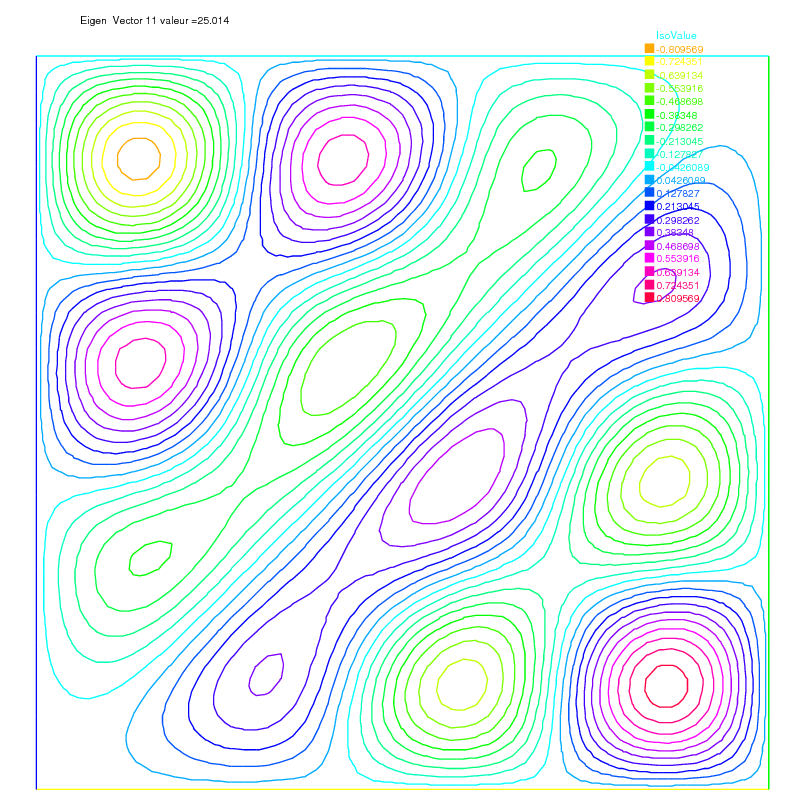
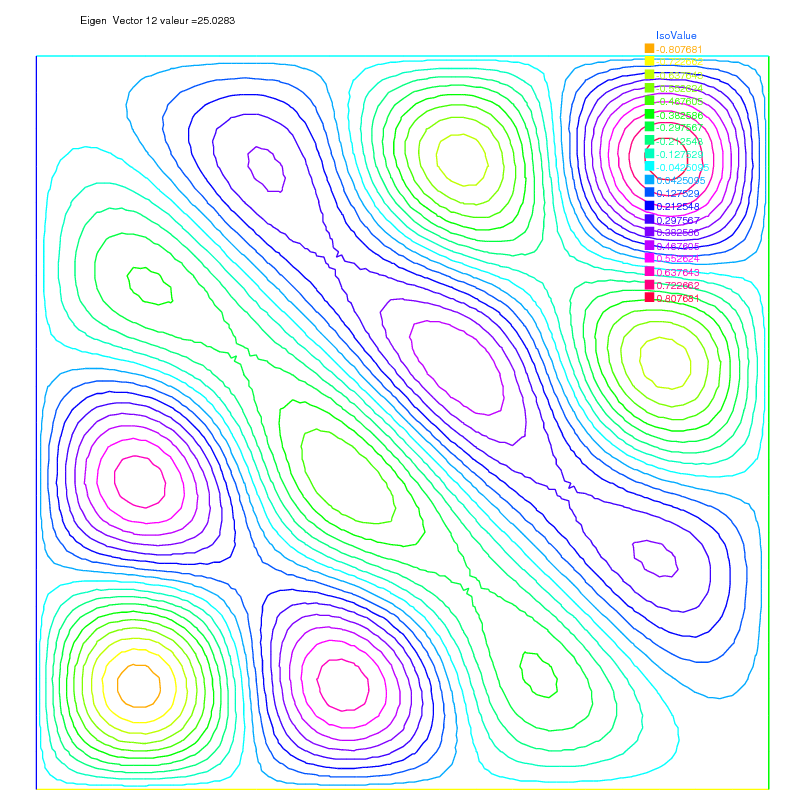

This section depends on your installation of FreeFem++; you need to have compiled `ARPACK`. This tool is available in FreeFem++ if the word eigenvalue appears in line Load:, like:

```bash
-- FreeFem++ v*.** (date *** *** ** **:**:** CET ****)
 file : ***.edp
 Load: lg_fem lg_mesh eigenvalue
```

This tool is based on [`arpack++`](http://www.caam.rice.edu/software/ARPACK/), the object-oriented version of `ARPACK` eigenvalue package [LEHOUCQ1998](#LEHOUCQ1998).

The function `:::freefem EigenValue` computes the generalized eigenvalue of $A u = \lambda B u$. The Shift-invert method is used by default, with sigma =$\sigma$ the shift of the method.

The matrix $OP$ is defined with $A - \sigma B$.

The return value is the number of converged eigenvalues (can be greater than the number of requested eigenvalues nev=)

```freefem
int k = EigenValue(OP, B, nev=Nev, sigma=Sigma);
```

where the matrix $OP= A - \sigma B $ with a solver and boundary condition, and the matrix $B$.

There is also a functional interface:

```freefem
int k = EigenValue(n, FOP1, FB, nev=Nev, sigma=Sigma);
```

where $n$ is the size of the problem, and the operators are now defined through functions, defining respectively the matrix product of $OP^{-1}$ and $B$, as in

```freefem
int n = OP1.n;
func real[int] FOP1(real[int] & u){ real[int] Au = OP^-1*u; return Au; }
func real[int] FB(real[int] & u){ real[int] Au = B*u; return Au; }
```

If you want finer control over the method employed in `ARPACK`, you can specify which mode `ARPACK` will work with (`:::freefem mode=` , see [ARPACK documentation](#LEHOUCQ1998)). The operators necessary for the chosen mode can be passed through the optional parameters `:::freefem A=`, `:::freefem A1=`, `:::freefem B=`, `:::freefem B1=`, (see below).

* `:::freefem mode=1`: Regular mode for solving $A u = \lambda u$

	```freefem
	int k = EigenValue(n, A=FOP, mode=1, nev=Nev);
	```

	where the function FOP defines the matrix product of A

* `:::freefem mode=2`: Regular inverse mode for solving $A u = \lambda B u$

	```freefem
	int k = EigenValue(n, A=FOP, B=FB, B1=FB1, mode=2, nev=Nev);
	```

	where the functions FOP, FB and FB1 define respectively the matrix product of $A$, $B$ and $B^{-1}$

* `:::freefem mode=3`: Shift-invert mode for solving $A u = \lambda B u$

	```freefem
	int k = EigenValue(n, A1=FOP1, B=FB, mode=3, sigma=Sigma, nev=Nev);
	```

	where the functions FOP1 and FB define respectively the matrix product of $OP^{-1} = (A - \sigma B)^{-1}$ and $B$

You can also specify which subset of eigenvalues you want to compute (`:::freefem which=`). The default value is `:::freefem which="LM"`, for eigenvalues with largest magnitude. `:::freefem "SM"` is for smallest magnitude, `:::freefem "LA"` for largest algebraic value, `:::freefem "SA"` for smallest algebraic value, and `:::freefem "BE"` for both ends of the spectrum.

Remark: For complex problems, you need to use the keyword `:::freefem complexEigenValue` instead of `:::freefem EigenValue` when passing operators through functions.

!!! note
	Boundary condition and Eigenvalue Problems

	The locking (Dirichlet) boundary condition is make with exact penalization so we put `:::freefem 1e30=tgv` on the diagonal term of the locked degree of freedom (see [Finite Element chapter](/documentation/FiniteElement/#variational-form-sparse-matrix-pde-data-vector)). So take Dirichlet boundary condition just on $A$ and not on $B$ because we solve $w=OP^{-1}*B*v$.

	<!--- ** --->

	If you put locking (Dirichlet) boundary condition on $B$ matrix (with key work `:::freefem on`) you get small spurious modes $(10^{-30})$, due to boundary condition, but if you forget the locking boundary condition on $B$ matrix (no keywork `:::freefem on`) you get huge spurious $(10^{30})$ modes associated to these boundary conditons. We compute only small mode, so we get the good one in this case.

* `:::freefem sym=`
	The problem is symmetric (all the eigen value are real)

* `:::freefem nev=`
	The number desired eigenvalues (nev) close to the shift.

* `:::freefem value=`
	The array to store the real part of the eigenvalues

* `:::freefem ivalue=`
	The array to store the imag. part of the eigenvalues

* `:::freefem vector=`
	The FE function array to store the eigenvectors

* `:::freefem rawvector=`
	An array of type `:::freefem real[int,int]` to store eigenvectors by column.

 	For real non symmetric problems, complex eigenvectors are given as two consecutive vectors, so if eigenvalue $k$ and $k+1$ are complex conjugate eigenvalues, the $k$th vector will contain the real part and the $k+1$th vector the imaginary part of the corresponding complex conjugate eigenvectors.

* `:::freefem tol=`
	The relative accuracy to which eigenvalues are to be determined;

* `:::freefem sigma=`
	The shift value;

* `:::freefem maxit=`
	The maximum number of iterations allowed;

* `:::freefem ncv=`
	The number of Arnoldi vectors generated at each iteration of `ARPACK`;

* `:::freefem mode=`
	The computational mode used by `ARPACK` (see above);

* `:::freefem which=`
The requested subset of eigenvalues (see above).

!!!example "Laplace eigenvalue"
	In the first example, we compute the eigenvalues and the eigenvectors of the Dirichlet problem on square $\Omega=]0,\pi[^2$.

	The problem is to find: $\lambda$, and $\nabla u_{\lambda}$ in $\mathbb{R}{\times} H^1_0(\Omega)$
	$$
	\int_\Omega \nabla u_{\lambda} \nabla v = \lambda \int_\Omega u v \quad \forall v \in H^1_0(\Omega)
	$$

	The exact eigenvalues are $\lambda_{n,m} =(n^2+m^2), (n,m)\in {\mathbb{N}_*}^2$ with the associated eigenvectors are $u_{{m,n}}=sin(nx)*sin(my)$.

	<!--- ** --->

	We use the generalized inverse shift mode of the `arpack++` library, to find 20 eigenvalues and eigenvectors close to the shift value $\sigma=20$.

	```freefem
	// Parameters
	verbosity=0;
	real sigma = 20; //value of the shift
	int nev = 20; //number of computed eigen value close to sigma

	// Mesh
	mesh Th = square(20, 20, [pi*x, pi*y]);

	// Fespace
	fespace Vh(Th, P2);
	Vh u1, u2;

	// Problem
	// OP = A - sigma B ; // the shifted matrix
	varf op (u1, u2)
		= int2d(Th)(
			  dx(u1)*dx(u2)
			+ dy(u1)*dy(u2)
			- sigma* u1*u2
		)
		+ on(1, 2, 3, 4, u1=0)
		;

	varf b ([u1], [u2]) = int2d(Th)(u1*u2); //no boundary condition

	matrix OP = op(Vh, Vh, solver=Crout, factorize=1); //crout solver because the matrix in not positive
	matrix B = b(Vh, Vh, solver=CG, eps=1e-20);

	// important remark:
	// the boundary condition is make with exact penalization:
	// we put 1e30=tgv on the diagonal term of the lock degree of freedom.
	// So take Dirichlet boundary condition just on $a$ variational form
	// and not on $b$ variational form.
	// because we solve $ w=OP^-1*B*v $

	// Solve
	real[int] ev(nev); //to store the nev eigenvalue
	Vh[int] eV(nev); //to store the nev eigenvector

	int k = EigenValue(OP, B, sym=true, sigma=sigma, value=ev, vector=eV,
		tol=1e-10, maxit=0, ncv=0);

	// Display & Plot
	for (int i = 0; i < k; i++){
		u1 = eV[i];
		real gg = int2d(Th)(dx(u1)*dx(u1) + dy(u1)*dy(u1));
		real mm = int2d(Th)(u1*u1) ;
		cout << "lambda[" << i << "] = " << ev[i] << ", err= " << int2d(Th)(dx(u1)*dx(u1) + dy(u1)*dy(u1) - (ev[i])*u1*u1) << endl;
		plot(eV[i], cmm="Eigen Vector "+i+" value ="+ev[i], wait=true, value=true);
	}
	```

	The output of this example is:

	```freefem
	lambda[0] = 5.0002, err= -1.46519e-11
	lambda[1] = 8.00074, err= -4.05158e-11
	lambda[2] = 10.0011, err= 2.84925e-12
	lambda[3] = 10.0011, err= -7.25456e-12
	lambda[4] = 13.002, err= -1.74257e-10
	lambda[5] = 13.0039, err= 1.22554e-11
	lambda[6] = 17.0046, err= -1.06274e-11
	lambda[7] = 17.0048, err= 1.03883e-10
	lambda[8] = 18.0083, err= -4.05497e-11
	lambda[9] = 20.0096, err= -2.21678e-13
	lambda[10] = 20.0096, err= -4.16212e-14
	lambda[11] = 25.014, err= -7.42931e-10
	lambda[12] = 25.0283, err= 6.77444e-10
	lambda[13] = 26.0159, err= 3.19864e-11
	lambda[14] = 26.0159, err= -4.9652e-12
	lambda[15] = 29.0258, err= -9.99573e-11
	lambda[16] = 29.0273, err= 1.38242e-10
	lambda[17] = 32.0449, err= 1.2522e-10
	lambda[18] = 34.049, err= 3.40213e-11
	lambda[19] = 34.0492, err= 2.41751e-10
	```

	|<a name="Fig17">Fig. 17</a>: Isovalue of 11th eigenvector $u_{4,3}-u_{3,4}$|
	|:----:|
	||

	|<a name="Fig18">Fig. 18</a>: Isovalue of 12th eigenvector $u_{4,3}+u_{3,4}$|
	|:----:|
	||

## References

<a name="LEHOUCQ1998">[LEHOUCQ1998]</a> LEHOUCQ, Richard B., SORENSEN, Danny C., et YANG, Chao. ARPACK users' guide: solution of large-scale eigenvalue problems with implicitly restarted Arnoldi methods. Siam, 1998.
