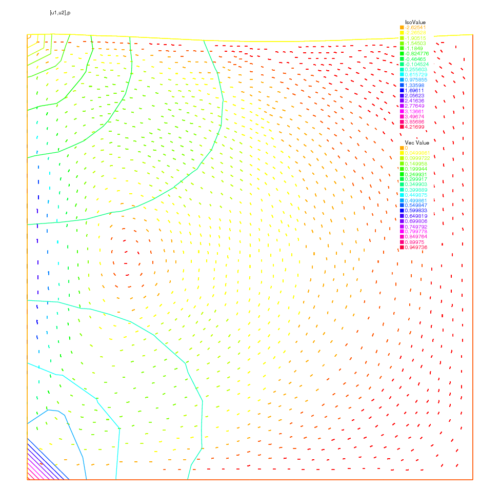

This problem involves the Lamé system of elasticity and the Stokes system for viscous fluids with velocity $\mathbf{u}$ and pressure $p$:

\begin{eqnarray*}
	-\Delta\mathbf{u} + \mathbf{\nabla} p &=& 0 & \hbox{ in }\Omega\\
	\nabla\cdot\mathbf{u} &=& 0 & \hbox{ in }\Omega\\
	\mathbf{u} &=& \mathbf{u}_\Gamma & \hbox{ on }\Gamma=\p\Omega
\end{eqnarray*}

where $u_\Gamma$ is the velocity of the boundaries. The force that the fluid applies to the boundaries is the normal stress

$$
\mathbf{h} =(\nabla\mathbf{u} +\nabla\mathbf{u}^T)\mathbf{n} -p\mathbf{n}
$$

Elastic solids subject to forces deform: a point in the solid at (x,y) goes to (X,Y) after. When the displacement vector $\mathbf{v}=(v_1,v_2) = (X-x, Y-y)$ is small, Hooke's law relates the stress tensor $\sigma$ inside the solid to the deformation tensor $\epsilon$:

$$
\sigma_{ij} = \lambda \delta_{ij} \nabla.\mathbf{v} + 2\mu\epsilon_{ij},
\,
\epsilon_{ij} = {1\over 2}({\p v_i\over\p x_j} + {\p v_j\over\p x_i} )
$$

where $\delta$ is the Kronecker symbol and where $\lambda$, $\mu$ are two constants describing the material mechanical properties in terms of the modulus of elasticity, and Young's modulus.

The equations of elasticity are naturally written in variational form for the displacement vector $v(x)\in V$ as

$$
\int_\Omega \left[2\mu\epsilon_{ij}(\mathbf{v})\epsilon_{ij}(\mathbf{w})
+\lambda \epsilon_{ii}(v)\epsilon_{jj}(\mathbf{w})\right]
=\int_\Omega \mathbf{g}\cdot \mathbf{w} +\int_\Gamma \mathbf{h}\cdot \mathbf{w},%\`{u}
\forall \mathbf{w}\in V
$$

The data are the gravity force $\mathbf{g}$ and the boundary stress $\mathbf{h}$.

!!!example "Fluide-structure"
	In our example, the Lamé system and the Stokes system are coupled by a common boundary on which the fluid stress creates a displacement of the boundary and hence changes the shape of the domain where the Stokes problem is integrated. The geometry is that of a vertical driven cavity with an elastic lid. The lid is a beam with weight so it will be deformed by its own weight and by the normal stress due to the fluid reaction. The cavity is the $10 \times 10$ square and the lid is a rectangle of height $l=2$.

	A beam sits on a box full of fluid rotating because the left vertical side has velocity one. The beam is bent by its own weight, but the pressure of the fluid modifies the bending.

	The bending displacement of the beam is given by $(uu, vv)$ whose solution is given as follows.

	```freefem
	// Parameters
	int bottombeam = 2; //label of bottombeam
	real E = 21.5;
	real sigma = 0.29;
	real gravity = -0.05;
	real coef = 0.2;

	// Mesh (solid)
	border a(t=2, 0){x=0; y=t; label=1;}
	border b(t=0, 10){x=t; y=0; label=bottombeam;}
	border c(t=0, 2){x=10; y=t; label=1;}
	border d(t=0, 10){x=10-t; y=2; label=3;}
	mesh th = buildmesh(b(20) + c(5) + d(20) + a(5));

	// Fespace (solid)
	fespace Vh(th, P1);
	Vh uu, w, vv, s;

	// Macro
	real sqrt2 = sqrt(2.);
	macro epsilon(u1, u2) [dx(u1), dy(u2), (dy(u1)+dx(u2))/sqrt2] //
	macro div(u1, u2) (dx(u1) + dy(u2)) //

	// Problem (solid)
	real mu = E/(2*(1+sigma));
	real lambda = E*sigma/((1+sigma)*(1-2*sigma));
	solve Elasticity([uu, vv], [w, s])
		= int2d(th)(
			  lambda*div(w,s)*div(uu,vv)
			+ 2.*mu*(epsilon(w,s)'*epsilon(uu,vv))
		)
		+ int2d(th)(
			- gravity*s
		)
		+ on(1, uu=0, vv=0)
		;

	plot([uu, vv], wait=true);
	mesh th1 = movemesh(th, [x+uu, y+vv]);
	plot(th1, wait=true);
	```

	Then Stokes equation for fluids at low speed are solved in the box below the beam, but the beam has deformed the box (see border h):

	```freefem
	// Mesh (fluid)
	border e(t=0, 10){x=t; y=-10; label= 1;}
	border f(t=0, 10){x=10; y=-10+t ; label= 1;}
	border g(t=0, 10){x=0; y=-t; label= 2;}
	border h(t=0, 10){x=t; y=vv(t,0)*( t>=0.001 )*(t <= 9.999); label=3;}
	mesh sh = buildmesh(h(-20) + f(10) + e(10) + g(10));
	plot(sh, wait=true);
	```

	 We use the Uzawa conjugate gradient to solve the Stokes problem like in [Navier-Stokes equations](NavierStokesEquations/#uzawa-algorithm-and-conjugate-gradients)

	```freefem
	// Fespace (fluid)
	fespace Xh(sh, P2);
	Xh u1, u2;
	Xh bc1;
	Xh brhs;
	Xh bcx=0, bcy=1;

	fespace Mh(sh, P1);
	Mh p, ppp;

	// Problem (fluid)
	varf bx (u1, q) = int2d(sh)(-(dx(u1)*q));
	varf by (u1, q) = int2d(sh)(-(dy(u1)*q));
	varf Lap (u1, u2)
		= int2d(sh)(
			  dx(u1)*dx(u2)
			+ dy(u1)*dy(u2)
		)
		+ on(2, u1=1)
		+ on(1, 3, u1=0)
		;

	bc1[] = Lap(0, Xh);

	matrix A = Lap(Xh, Xh, solver=CG);
	matrix Bx = bx(Xh, Mh);
	matrix By = by(Xh, Mh);


	func real[int] divup (real[int] & pp){
		int verb = verbosity;
		verbosity = 0;
		brhs[] = Bx'*pp;
		brhs[] += bc1[] .*bcx[];
		u1[] = A^-1*brhs[];
		brhs[] = By'*pp;
		brhs[] += bc1[] .*bcy[];
		u2[] = A^-1*brhs[];
		ppp[] = Bx*u1[];
		ppp[] += By*u2[];
		verbosity = verb;
		return ppp[];
	}
	```

	do a loop on the two problems

	```freefem
	// Coupling loop
	for(int step = 0; step < 10; ++step){
		// Solve (fluid)
		LinearCG(divup, p[], eps=1.e-3, nbiter=50);
		divup(p[]);
	```

	Now the beam will feel the stress constraint from the fluid:

	```freefem
		// Forces
		Vh sigma11, sigma22, sigma12;
		Vh uu1=uu, vv1=vv;

		sigma11([x+uu, y+vv]) = (2*dx(u1) - p);
		sigma22([x+uu, y+vv]) = (2*dy(u2) - p);
		sigma12([x+uu, y+vv]) = (dx(u1) + dy(u2));
	```

	which comes as a boundary condition to the PDE of the beam:

	```freefem
		// Solve (solid)
		solve Elasticity2 ([uu, vv], [w, s], init=step)
		= int2d(th)(
			  lambda*div(w,s)*div(uu,vv)
			+ 2.*mu*(epsilon(w,s)'*epsilon(uu,vv))
		)
		+ int2d(th)(
			- gravity*s
		)
		+ int1d(th, bottombeam)(
			- coef*(sigma11*N.x*w + sigma22*N.y*s + sigma12*(N.y*w+N.x*s))
		)
		+ on(1, uu=0, vv=0)
		;

		// Plot
		plot([uu, vv], wait=1);

		// Error
		real err = sqrt(int2d(th)((uu-uu1)^2 + (vv-vv1)^2));
		cout << "Erreur L2 = " << err << endl;
	```

	Notice that the matrix generated by `:::freefem Elasticity2` is reused (see [`:::freefem init=i`](/reference/Types/#problem-design)). Finally we deform the beam

	```freefem
		// Movemesh
		th1 = movemesh(th, [x+0.2*uu, y+0.2*vv]);
		plot(th1, wait=true);
	}
	```

	|<a name="Fig29">Fig. 29</a>: Fluid velocity and pressure, displacement vector of the structure and displaced geometry in the fluid-structure interaction of a soft side and a driven cavity|
	|:----:|
	||
	||
	||
