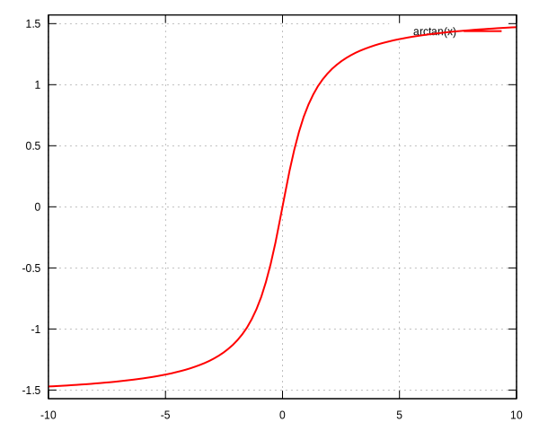
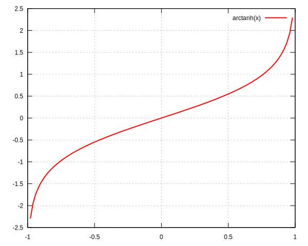
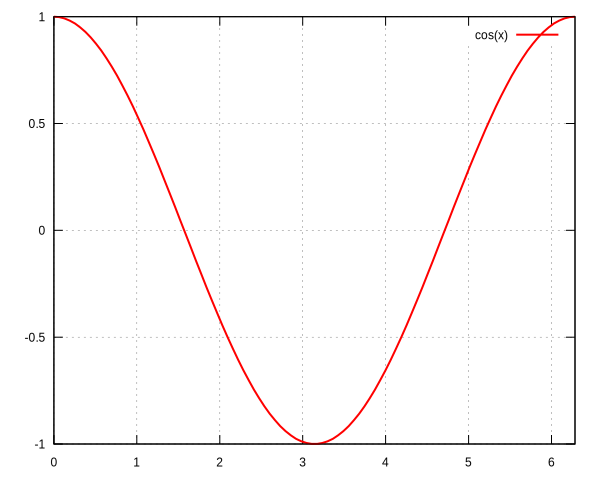

<!--
## function

```freefem
example code
```

<u>Parameters:</u>

-

<u>Output:</u>

-
-->

## acos
$\arccos$ function.
```freefem
real theta = acos(x);
```

<u>Parameter:</u>

 - `x` (`:::freefem real`)

<u>Output:</u>

 - `theta` (`:::freefem real`)


## acosh
$\DeclareMathOperator\arccosh{arccosh}$
$\arccosh$ function.
```freefem
real theta = acosh(x);
```

<u>Parameter:</u>

- `x` (`:::freefem real`)

<u>Output:</u>

- `theta` (`:::freefem real`)


## adaptmesh
Mesh adaptation function.
```freefem
mesh Thnew = adaptamesh(Th, [fx, fy], hmin=HMin, hmax=HMax, err=Err, errg=ErrG, nbvx=NbVx, nbsmooth=NbSmooth, nbjacoby=NbJacoby, ratio=Ratio, omega=Omega, iso=Iso, abserror=AbsError, cutoff=CutOff, verbosity=Verbosity, inquire=Inquire, splitpbedge=SplitPbEdge, maxsubdiv=MaxSubdiv, rescaling=Rescaling, keepbackvertices=KeepBackVertices, isMetric=IsMetric, power=Power, thetamax=ThetaMax, splitin2=SplitIn2, metric=Metric, nomeshgeneration=NoMeshGeneration, periodic=Periodic);
```

<u>Parameters:</u>

 - `Th` (`:::freefem mesh` or `:::freefem mesh3`)<br/>
 Mesh to refine
 - `[fx, fy]` (`:::freefem func` or `:::freefem fespace` function), scalar or vectorial<br/>
 Function to follow for the mesh adaptation
 - _`:::freefem hmin=`_ (`:::freefem real`)<br/>
 Minimum edge size
 - _`:::freefem hmax=`_ (`:::freefem real`)<br/>
 Maximum edge size
 - _`:::freefem err=`_ (`:::freefem real`)<br/>
 Error level (P1 interpolation)
 - _`:::freefem errg=`_ (`:::freefem real`)<br/>
 Relative geometrical error
 - _`:::freefem nbvx=`_ (`:::freefem int`)<br/>
 Maximum number of vertices
 - _`:::freefem nbsmooth=`_ (`:::freefem int`)<br/>
 Number of smoothing iterations
 - _`:::freefem nbjacoby=`_ (`:::freefem int`)<br/>
 Number of iterations for the smoothing procedure
 - _`:::freefem ratio=`_ (`:::freefem real`)<br/>
 Ratio of the triangles
 - _`:::freefem omega=`_ (`:::freefem real`)<br/>
 Relaxation parameter for the smoothing procedure
 - _`:::freefem iso=`_ (`:::freefem bool`)<br/>
 Isotropic adaptation (if true)
 - _`:::freefem abserror=`_ (`:::freefem bool`)<br/>
 Error (if true) - Relative error (if false)
 - _`:::freefem cutoff=`_ (`:::freefem real`)<br/>
 Lower limit of the relative error evaluation
 - _`:::freefem verbosity=`_ (`:::freefem real`)<br/>
 Verbosity level
 - _`:::freefem inquire=`_ (`:::freefem bool`)<br/>
 If true, inquire graphically
 - _`:::freefem splitpbedge=`_ (`:::freefem bool`)<br/>
 If true, split all internal edges in half
 - _`:::freefem maxsubdiv=`_ (`:::freefem int`)<br/>
 Bound the maximum subdivisions
 - _`:::freefem rescaling=`_ (`:::freefem bool`)<br/>
 Rescale the function in [0, 1]
 - _`:::freefem keepbackvertices=`_ (`:::freefem bool`)<br/>
 If true, try to keep vertices of the original mesh
 - _`:::freefem isMetric=`_ (`:::freefem bool`)<br/>
 If true, the metric is defined explicitly
 - _`:::freefem power=`_ (`:::freefem int`)<br/>
 Exponent of the Hessian
 - _`:::freefem thetamax=`_ (`:::freefem int`)<br/>
 Minimum corner angle (in degree)
 - _`:::freefem splitin2=`_ (`:::freefem bool`)<br/>
 Split all triangles into 4 sub-triangles if true
 - _`:::freefem metric=`_ (`:::freefem [real[int], real[int], real[int]]`)<br/>
 Array of 3 real arrays defining the metric
 - _`:::freefem nomeshgeneration=`_ (`:::freefem bool`)<br/>
 If true, the mesh is not generated
 - _`:::freefem periodic=`_ (`:::freefem real[int, int]`)<br/>
 Build an adapted periodic mesh

<u>Output:</u>

 - `Thnew` (`:::freefem mesh` or `:::freefem mesh3`)

## adj
Adjacent triangle of the triangle $k$ by the edge $e$
```freefem
int T = Th[k].adj(e);
```
<u>Parameter:</u>

 - `e` (`:::freefem int`)<br/>
 Edge number

<u>Output:</u>

 - `T` (`:::freefem int`)<br/>
 Triangle number

## AffineCG
Affine conjugate gradient solver

Used to solve a problem like $Ax=b$

```freefem
int Conv = AffineCG(A, x, precon=Precon, nbiter=NbIter, eps=Eps, veps=VEps, stop=Stop);
```

<u>Parameter:</u>

 - `A` (`:::freefem matrix`)<br/>
 Matrix of the problem $Ax=b$
 - `x` (`:::freefem real[int]`)<br/>
 Solution vector
 - _`:::freefem precon=`_ (`:::freefem real[int]`)<br/>
 Preconditionning function
 - _`:::freefem nbiter=`_ (`:::freefem int`)<br/>
 Maximum number of iterations
 - _`:::freefem eps=`_ (`:::freefem real`)<br/>
 Convergence criterion<br/>
 If $\varepsilon>0$: test $||A(x)||_p \leq \epsilon||A(x_0)||_p$<br/>
 If $\varepsilon<0$: test $||A(x)||_p^2 \leq |\epsilon|$
 - _`:::freefem veps=`_ (`:::freefem real`)<br/>
 Same as `eps`, but return `-eps`
 - _`:::freefem stop=`_ (`:::freefem func`)<br/>
 Convergence criterion as a function<br/>
 Prototype is `:::freefem func bool StopFunc (int Iter, real[int] U, real[int] g)`<br/>
 `u`: current solution, `g`: current gradient (not preconditionned)

<u>Output:</u>

 - Conv (int)<br/>
 0: converged - !0: not converged

## AffineGMRES
Affine GMRES solver

Parameters and output are the same as [AffineCG](#affinecg)

## asin
$\arcsin$ function.
```freefem
real theta = asin(x);
```

<u>Parameter:</u>

 - `x` (`:::freefem real`)

<u>Output:</u>

 - `theta` (`:::freefem real`)


## asinh
$\DeclareMathOperator\arcsinh{arcsinh}$
$\arcsinh$ function.
```freefem
real theta = asinh(x);
```

<u>Parameter:</u>

 - `x` (`:::freefem real`)

<u>Output:</u>

 - `theta` (`:::freefem real`)


## assert
Verify a condition is true (same as C), if not the program stops.
```freefem
assert(x==0)
```

<u>Parameter:</u>

 - Bollean condition

<u>Output:</u>

 - None

## atan
$\arctan$ function.
```freefem
real theta = atan(x);
```

<u>Parameter:</u>

 - `x` (`:::freefem real`)

<u>Output:</u>

 - `theta` (`:::freefem real`)



## atan2
$\displaystyle{\arctan\left(\frac{y}{x}\right)}$ function, returning the correct sign for $\theta$.
```freefem
real theta = atan2(y, x)
```

<u>Parameter:</u>

 - `x` (`:::freefem real`)

<u>Output:</u>

 - `theta` (`:::freefem real`)

## atanh
$\DeclareMathOperator\arctanh{arctanh}$
$\arctanh$ function.
```freefem
real theta = atanh(x);
```

<u>Parameter:</u>

 - `x` (real)

<u>Output:</u>

 - `theta` (real)



## BFGS

$\codered$

## buildmesh
Build a 2D mesh using border elements.
```freefem
mesh Th = buildmesh(b1(nn) + b2(nn) + b3(nn) + b4(nn), [nbvx=Nbvx], [fixedborder=FixedBorder]);
```

<u>Parameters:</u>

 - `b1`, `b2`, `b3`, `b4` (`:::freefem border`)<br/>
 Geometry border, `b1(nn)` mean `b1` border discretize by `nn` vertices
 - _`:::freefem nbvx=`_ (`:::freefem int`) _[Optional]_<br/>
 Maximum number of vertices<br/>
 Default: 9000
 - _`:::freefem fixedborder=`_ (`:::freefem bool`) _[Optional]_<br/>
 If true, mesh generator can not change the boundary mesh<br/>
 Default: `:::freefem false`
 <!--- - _`:::freefem fixeborder=`_ (`:::freefem bool`) _[Deprecated]_ --->

<u>Output:</u>

 - `Th` (`:::freefem mesh`)<br/>
 Resulting mesh

## ceil
Round fractions up of $x$.
```freefem
int c = ceil(x);
```

<u>Parameter:</u>

 - `x` (`:::freefem real`)

<u>Output:</u>

 - `c` (`:::freefem int`)

## change
Change a property of a mesh.
```freefem
int[int] L = [0, 1];
Thnew = change(Th, label=L);
```

<u>Parameter:</u>

 - `Th` (`:::freefem mesh`)<br/>
 Original mesh

 - _`:::freefem label=`_ L (`:::freefem int[int]`)<br/>
 Pair of old and new label
 - _`:::freefem region=`_ R (`:::freefem int[int]`)<br/>
 Pair of old and new region
 - _`:::freefem flabel=`_ l (`:::freefem func int`)<br/>
 Function of int given the new label
 - _`:::freefem fregion=`_ r (`:::freefem func int`)</br>
 Function of int given the new region

<u>Output:</u>

 - `:::freefem Thnew` (`:::freefem mesh`)
 Mesh with changed parameters

## checkmovemesh
Check a [`:::freefem movemesh`](#movemesh) without mesh generation.

$\codered$

<u>Parameter:</u>

<u>Output:</u>

## clock
Get the clock in second.
```freefem
real t = clock();
```

<u>Parameter:</u>

 - None

<u>Output:</u>

 - `t` (`:::freefem real`)<br/>
 Current CPU time

## conj
Caculate the conjuguate of a complex number.
```freefem
complex C1 = 1 + 1i;
complex C2 = conj(C1);
```

<u>Parameter:</u>

 - `C1` (`:::freefem complex`)<br/>
 Complex number

<u>Output:</u>

 - `C2` (`:::freefem complex`)<br/>
 Conjuguate of C1

## convect
Characteristic Galerkin method.
```freefem
convect([ux, uy], dt, c);
```

$\codered$

<u>Parameter:</u>

<u>Output:</u>


## cos
$\cos$ function.

```freefem
real x = cos(theta);
```

<u>Parameters:</u>

 - `theta` (`:::freefem real`)

<u>Output:</u>

 - `x` (`:::freefem real`)



## cosh

$\cosh$ function.

```freefem
real x = cosh(theta);
```

<u>Parameters:</u>

 - `theta` (`:::freefem real`)

<u>Output:</u>

 - `x` (`:::freefem real`)

## cube
Construct a cubic mesh.

Need:
```freefem
include "cube.idp"
```

```freefem
mesh3 Th = cube(nnX, nnY, nnZ, [X(x), Y(y), Z(z)], [label=Label], [flags=Flags], [region=Region]);
```

<u>Parameters:</u>

 - `nnX` (`:::freefem int`)<br/>
 Number of discretization point along $x$
 - `nnY` (`:::freefem int`)<br/>
 Number of discretization point along $y$
 - `nnZ` (`:::freefem int`)<br/>
  Number of discretization point along $z$
  - `X(x)` (`:::freefem func`) _[Optional]_<br/>
  Affine function of $x$ to define the length<br/>
  Default: `x`
  - `Y(y)` (`:::freefem func`) _[Optional]_<br/>
  Affine function of $y$ to define the width<br/>
  Default: `y`
  - `Z(z)` (`:::freefem func`) _[Optional]_<br/>
  Affine function of $z$ to define the height<br/>
  Default: `z`
  - _`:::freefem label=`_ (`:::freefem int[int]`) _[Optional]_<br/>
  List of surface labels<br/>
  Default: `[1, 2, 3, 4, 5, 6]`
  - _`:::freefem flags=`_ (`:::freefem int`) _[Optional]_<br/>
  Refer to [square](#square)
  - _`:::freefem region=`_ (`:::freefem int`) _[Optional]_<br/>
  Region number of the cube volume
  Default: `0`

<u>Output:</u>

 - `Th` (`:::freefem mesh3`)<br/>
 Cube mesh

## diffnp
Arithmetic useful function.
```freefem
diffnp(a, b) = (a<0)&(0<b) ? (b-a) : 0;
```

## diffpos
Arithmetic useful function.
```freefem
diffpos(a, b) = max(b-a, 0);
```

## dist
Arithmetic useful function.
```freefem
dist(a, b, c) = sqrt(a^2 + b^2 + c^2);
```

## dx

$x$ derivative.

```freefem
Uh up = dx(u);
```
$$
\frac{\partial u}{\partial x}
$$

<u>Parameters:</u>

- `u` (`:::freefem fespace` function)

<u>Output:</u>

- `up` (`:::freefem fespace` function)

## dxx

$x$ double derivative.

```freefem
Uh upp = dxx(u);
```
$$
\frac{\partial^2 u}{\partial x^2}
$$

<u>Parameters:</u>

- `u` (`:::freefem fespace` function)

<u>Output:</u>

- `upp` (`:::freefem fespace` function)

## dxy

$xy$ derivative.

```freefem
Uh upp = dxy(u);
```
$$
\frac{\partial^2 u}{\partial x\partial y}
$$

<u>Parameters:</u>

- `u` (`:::freefem fespace` function)

<u>Output:</u>

- `upp` (`:::freefem fespace` function)

## dxz

$xz$ derivative.

```freefem
Uh upp = dxz(u);
```
$$
\frac{\partial^2 u}{\partial x\partial z}
$$

<u>Parameters:</u>

- `u` (`:::freefem fespace` function)

<u>Output:</u>

- `upp` (`:::freefem fespace` function)

## dy

$y$ derivative.

```freefem
Uh up = dy(u);
```
$$
\frac{\partial u}{\partial y}
$$

<u>Parameters:</u>

- `u` (`:::freefem fespace` function)

<u>Output:</u>

- `upp` (`:::freefem fespace` function)

## dyx

$yx$ derivative.

```freefem
Uh upp = dyx(u);
```
$$
\frac{\partial^2 u}{\partial y\partial x}
$$

<u>Parameters:</u>

- `u` (`:::freefem fespace` function)

<u>Output:</u>

- `upp` (`:::freefem fespace` function)

## dyy

$y$ double derivative.

```freefem
Uh upp = dyy(u);
```
$$
\frac{\partial^2 u}{\partial x^2}
$$

<u>Parameters:</u>

- `u` (`:::freefem fespace` function)

<u>Output:</u>

- `upp` (`:::freefem fespace` function)

## dyz

$yz$ derivative.

```freefem
Uh upp = dyz(u);
```
$$
\frac{\partial^2 u}{\partial y\partial z}
$$

<u>Parameters:</u>

- `u` (`:::freefem fespace` function)

<u>Output:</u>

- `upp` (`:::freefem fespace` function)

## dz

$z$ derivative.

```freefem
Uh up = dz(u);
```
$$
\frac{\partial u}{\partial z}
$$

<u>Parameters:</u>

- `u` (`:::freefem fespace` function)

<u>Output:</u>

- `upp` (`:::freefem fespace` function)

## dzx

$zx$ derivative.

```freefem
Uh upp = dzx(u);
```
$$
\frac{\partial^2 u}{\partial z\partial x}
$$

<u>Parameters:</u>

- `u` (`:::freefem fespace` function)

<u>Output:</u>

- `upp` (`:::freefem fespace` function)

## dzy

$zy$ derivative.

```freefem
Uh upp = dzy(u);
```
$$
\frac{\partial^2 u}{\partial z\partial y}
$$

<u>Parameters:</u>

- `u` (`:::freefem fespace` function)

<u>Output:</u>

- `upp` (`:::freefem fespace` function)

## dzz

$z$ double derivative.

```freefem
Uh upp = dzz(u);
```
$$
\frac{\partial^2 u}{\partial z^2}
$$

<u>Parameters:</u>

- `u` (`:::freefem fespace` function)

<u>Output:</u>

- `upp` (`:::freefem fespace` function)

## EigenValue

$\codered$

## emptymesh
Build an empty mesh.

Useful to handle Lagrange multipliers in mixed and Mortar methods.
```freefem
mesh eTh = emptymesh(Th, ssd);
```

<u>Parameters:</u>

 - `Th` (`:::freefem mesh`)<br/>
 Mesh to empty
 - `ssd` (`:::freefem int[int]`)<br/>
 $\codered$

<u>Output:</u>

 - `eTh` (`:::freefem mesh`)<br/>
 Empty mesh

## erf
The error function:
$$
erf(x) = \frac{2}{\sqrt{pi}}\int_{0}^{x}{\exp(-t^2)dt}
$$
```freefem
real err = erf(x);
```

<u>Parameters:</u>

 - `x` (`:::freefem real`)

<u>Output:</u>

 - `err` (`:::freefem real`)

## erfc
Complementary of the [error function](#erf):
$$
erfc(x) = 1-erf(x)
$$
```freefem
real errc = erfc(x);
```

<u>Parameters:</u>

 - `x` (`:::freefem real`)

<u>Output:</u>

 - `err` (`:::freefem real`)

## exec
Execute an external command.
```freefem
int v = exec(command);
```

<u>Parameters:</u>

 - `command` (`:::freefem string`)<br/>
 Command to execute

<u>Output:</u>

 - `v` (`:::freefem int`)<br/>
 Value returned by the command

## exit
Exit function, equivalent to `return`.
```freefem
exit(N);
```

<u>Parameters:</u>

 - `N` (`:::freefem int`)<br/>
 Return value

<u>Output:</u>

 - None

## exp
Exponential function.
```freefem
real a = exp(b);
```

<u>Parameters:</u>

 - `b` (`:::freefem real`)

<u>Output:</u>

 - `a` (`:::freefem real`)

## fdim
Positive difference (`cmath` function).
```freefem
real fd = fdim(a, b);
```

<u>Parameters:</u>

 - `a` (`:::freefem real`)
 - `b` (`:::freefem real`)

<u>Output:</u>

 - `fd` (`:::freefem real`)<br/>
 If $x > y$, return $x-y$<br/>
 If $x \leq y$, return $0$

## floor
Floor function.
```freefem
real a = floor(b);
```
Return the largest integer value not greater than `b`.

<u>Parameters:</u>

 - `b` (`:::freefem real`)

<u>Output:</u>

 - `a` (`:::freefem real`)

## fmax
Maximum (`cmath` function).
```freefem
real Max = fmax(a, b);
```

<u>Parameters:</u>

 - `a` (`:::freefem real`)
 - `b` (`:::freefem real`)

<u>Output:</u>

 - `Max` (`:::freefem real`)

## fmin
Minimum (`cmath` function).
```freefem
real Min = fmin(a, b);
```

<u>Parameters:</u>

 - `a` (`:::freefem real`)
 - `b` (`:::freefem real`)

<u>Output:</u>

 - `Min` (`:::freefem real`)

## fmod
Remainder of $a/b$ (`cmath` function).
```freefem
real Mod = fmin(a, b);
```

<u>Parameters:</u>

 - `a` (`:::freefem real`)
 - `b` (`:::freefem real`)

<u>Output:</u>

 - `Min` (`:::freefem real`)

<u>Parameters:</u>

 - `a` (`:::freefem real`)
 - `b` (`:::freefem real`)

<u>Output:</u>

 - `Mod` (`:::freefem real`)

## imag
Imaginary part of a complex number.
```freefem
complex c = 1. + 1i;
real Im = imag(c);
```

## int1d
1D integral.
```freefem
int1d(Th, [Label], [qfe=Qfe], [qforder=Qforder])(
	...
)
```
Used in [problem](types/#problem), [solve](types/#solve) or [varf](types/#varf) definition to impose a boundary condition only (FreeFem++ does not support 1D simulation), or outside to calculate a quantity.

<u>Parameters:</u>

 - `Th` (`:::freefem mesh`)<br/>
 Mesh where the integral is calculated
 - `Label` (`:::freefem int`) _[Optional]_<br/>
 Label of the 1D border<br/>
 Default: all borders of the mesh
 - _`:::freefem qfe=`_ ([quadrature formula](../quadrature)) _[Optional]_<br/>
 Quadrature formula, see [quadrature formulae](quadrature/#int1d)
 - _`:::freefem qforder=`_ ([quadrature formula](../quadrature)) _[Optional]_<br/>
 Quadrature order, see [quadrature formulae](quadrature/#int1d)

<u>Output:</u>

 - Depending on the situation:<br/>
 In a `:::freefem problem`, `:::freefem solve` or `:::freefem varf` definition: Non relevant.<br/>
 Outside: `:::freefem real` (example: `:::freefem real l = int1d(Th, 1)(1.);`).

!!!warning ""
    In a `:::freefem problem`, `:::freefem solve` or `:::freefem varf` definition, the content of `int1d` must be a linear or bilinear form.

## int2d
2D integral.
```freefem
int2d(Th, [Region], [qfe=Qfe], [qforder=Qforder])(
	...
)
```
Or
```freefem
int2d(Th, [Label], [qfe=Qfe], [qforder=Qforder])(
	...
)
```
Used in [problem](types/#problem), [solve](types/#solve) or [varf](types/#varf) definition to:
 - Calculate integral in 2D simulation
 - Impose a boundary condition in 3D simulation
Or outside to calculate a quantity.

<u>Parameters:</u>

 - `Th` (`:::freefem mesh`)<br/>
 Mesh where the integral is calculated
 - `Region` (`:::freefem int`) _[Optional]_<br/>
 Label of the 2D region (2D simulation)<br/>
 Default: all regions of the mesh
 - `Label` (`:::freefem int`) _[Optional]_<br/>
 Label of the 2D border (3D simulation)<br/>
 Default: all borders of the mesh
 - _`:::freefem qfe=`_ ([quadrature formula](../quadrature)) _[Optional]<br/>
 Quadrature formula, see [quadrature formulae](quadrature/#int2d)
 - _`:::freefem qforder`=_ ([quadrature formula](../quadrature)) _[Optional]_<br/>
 Quadrature order, see [quadrature formulae](quadrature/#int2d)

<u>Output:</u>

 - Depending on the situation:<br/>
 In a `:::freefem problem`, `:::freefem solve` or `:::freefem varf` definition: Non relevant.<br/>
 Outside: `:::freefem real` (example: `:::freefem real s = int2d(Th, 1)(1.);`).

!!!warning ""
	In a `:::freefem problem`, `:::freefem solve` or `:::freefem varf` definition, the content of the `:::freefem int2d` must be a linear or bilinear form.

## int3d
3D integral.
```freefem
int3d(Th, [Region], [qfe=Qfe], [qforder=Qforder])(
	...
)
```
Used in [problem](types/#problem), [solve](types/#solve) or [varf](types/#varf) definition to calculate integral in 3D simulation, or outside to calculate a quantity.

<u>Parameters:</u>

 - `Th` (`:::freefem mesh`)<br/>
 Mesh where the integral is calculated
 - `Region` (`:::freefem int`) _[Optional]_<br/>
 Label of the 3D region<br/>
 Default: all regions of the mesh
 - _`:::freefem qfe`=_ ([quadrature formula](../quadrature)) _[Optional]<br/>
 Quadrature formula, see [quadrature formulae](quadrature/#int3d)
 - _`:::freefem qforder=`_ ([quadrature formula](../quadrature)) _[Optional]_<br/>
 Quadrature order, see [quadrature formulae](quadrature/#int3d)

 <u>Output:</u>

  - Depending on the situation:<br/>
  In a `:::freefem problem`, `:::freefem solve` or `:::freefem varf` definition: Non relevant.<br/>
  Outside: `:::freefem real` (example: `:::freefem real v = int3d(Th, 1)(1.);`).

 !!!warning ""
 	In a `:::freefem problem`, `:::freefem solve` or `:::freefem varf` definition, the content of the `:::freefem int3d` must be a linear or bilinear form.

## intalledges

$\codered$

## interpolate
Interpolation matrix.
```freefem
matrix I = interpolate(Vh, Wh, inside=Inside, t=T, op=Op, U2Vc=U2VC);
```
$\codered$

## invdiffnp
Arithmetic useful function.
```freefem
invdiffnp(a, b) = (a<0)&(0<b) ? 1/(b-a) : 0
```

## invdiffpos
Arithmetic useful function.
```freefem
invdiffpos(a, b) = (a<b) ? 1./(b-a) : 0
```

## j0
Bessel function of first kind, order 0.
```freefem
real b = j0(x);
```

<u>Parameters:</u>

- `x` (`:::freefem real`)

<u>Output:</u>

- `b` (`:::freefem real`)

## j1
Bessel function of first kind, order 1.
```freefem
real b = j1(x);
```

<u>Parameters:</u>

- `x` (`:::freefem real`)

<u>Output:</u>

- `b` (`:::freefem real`)

## jn
Bessel function of first kind, order n.
```freefem
real b = jn(n, x);
```
$$
J_n(x) = \sum_{p=0}^{\infty}\frac{(1)^p}{p!(n+p)!}\left(\frac{x}{2}\right)^{2p+n}
$$

<u>Parameters:</u>

- `n` (`:::freefem int`)
- `x` (`:::freefem real`)

<u>Output:</u>

- `b` (`:::freefem real`)

## jump

$\codered$

## LinearCG

$\codered$

## LinearGMRES

$\codered$

## lgamma

$\codered$

## log

$\codered$

## log10

$\codered$

## max

$\codered$

## mean

$\codered$

## min

$\codered$

## movemesh

$\codered$

## NLCG

$\codered$

## on

$\codered$

## plot

$\codered$

## polar

$\codered$

## pow
Power function.
```freefem
real p = pow(a, b);
```
$p=a^b$

<u>Parameters:</u>

 - `a` (`:::freefem real`)
 - `b` (`:::freefem real`)

<u>Output:</u>

 - `p` (`:::freefem real`)

## projection
Arithmetic useful function.
```freefem
projection(a, b, x) = min(max(a, x), b);
```

## readmesh

$\codered$

## readmesh3

$\codered$

## round

$\codered$

## savemesh

$\codered$

## set

$\codered$

## sin

$\codered$

## sinh

$\codered$

## sort

$\codered$

## splitmesh

$\codered$

## square

$\codered$

## tan

$\codered$

## tanh

$\codered$

## tgamma

$\codered$

## trunc

$\codered$

## y0
Bessel function of second kind, order 0.
```freefem
real B = y0(x);
```

<u>Parameters:</u>

- `x` (`:::freefem real`)

<u>Output:</u>

- `b` (`:::freefem real`)

## y1
Bessel function of second kind, order 1.
```freefem
real B = y1(x);
```

<u>Parameters:</u>

- `x` (`:::freefem real`)

<u>Output:</u>

- `b` (`:::freefem real`)

## yn
Bessel function of second kind, order n.
```freefem
real B = yn(n, x);
```
$$
Y_n(x) = \lim_{\lambda\rightarrow n}{\frac{J_{\lambda}(x)\cos(\lambda\pi)-J_{-\lambda}(x)}{\sin(\lambda\pi)}}
$$

<u>Parameters:</u>

- `n` (`:::freefem int`)
- `x` (`:::freefem real`)

<u>Output:</u>

- `b` (`:::freefem real`)
