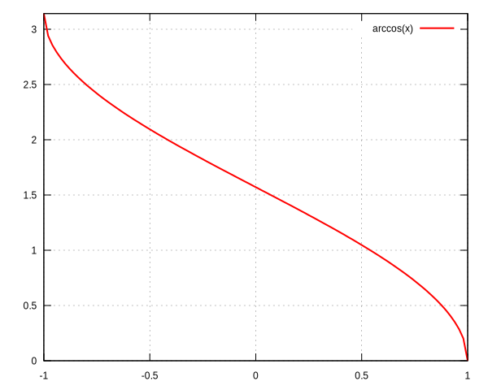
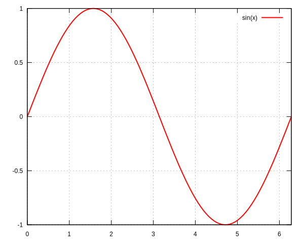
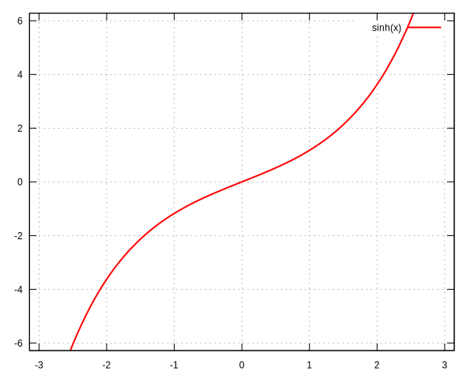
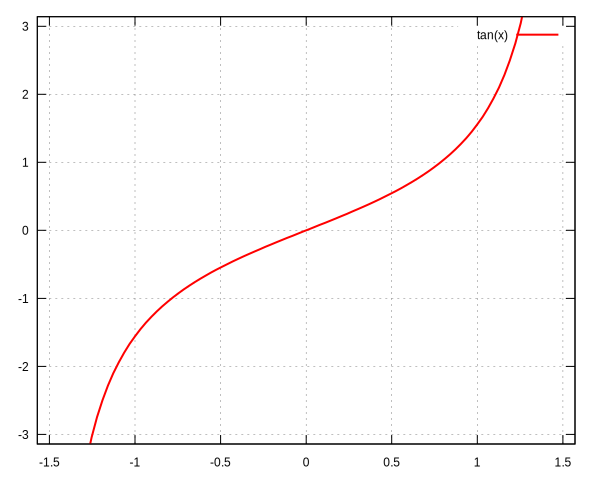
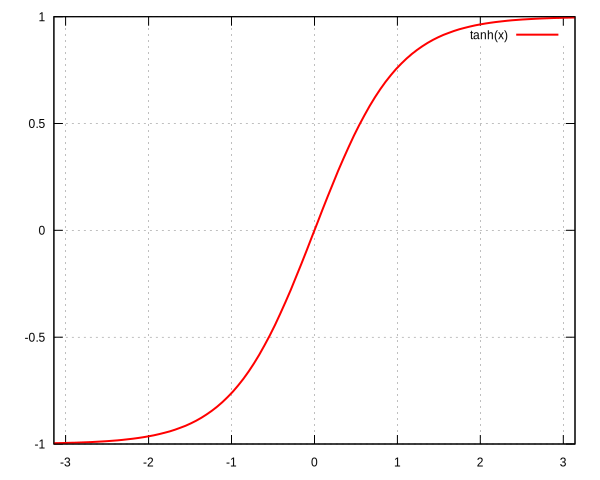

<!--
## function

```freefem
example code
```

<u>Parameters:</u>

-

<u>Output:</u>

-
-->

## acos
$\arccos$ function.
```freefem
real theta = acos(x);
```

<u>Parameter:</u>

 - `x` (`:::freefem real`)

<u>Output:</u>

 - `theta` (`:::freefem real`)



## acosh
$\DeclareMathOperator\arccosh{arccosh}$
$\arccosh$ function.
```freefem
real theta = acosh(x);
```

<u>Parameter:</u>

- `x` (`:::freefem real`)

<u>Output:</u>

- `theta` (`:::freefem real`)


## adaptmesh
Mesh adaptation function.
```freefem
mesh Thnew = adaptamesh(Th, [fx, fy], hmin=HMin, hmax=HMax, err=Err, errg=ErrG, nbvx=NbVx, nbsmooth=NbSmooth, nbjacoby=NbJacoby, ratio=Ratio, omega=Omega, iso=Iso, abserror=AbsError, cutoff=CutOff, verbosity=Verbosity, inquire=Inquire, splitpbedge=SplitPbEdge, maxsubdiv=MaxSubdiv, rescaling=Rescaling, keepbackvertices=KeepBackVertices, isMetric=IsMetric, power=Power, thetamax=ThetaMax, splitin2=SplitIn2, metric=Metric, nomeshgeneration=NoMeshGeneration, periodic=Periodic);
```

<u>Parameters:</u>

 - `Th` (`:::freefem mesh` or `:::freefem mesh3`)<br/>
 Mesh to refine
 - `[fx, fy]` (`:::freefem func` or `:::freefem fespace` function), scalar or vectorial<br/>
 Function to follow for the mesh adaptation
 - _`:::freefem hmin=`_ (`:::freefem real`)<br/>
 Minimum edge size
 - _`:::freefem hmax=`_ (`:::freefem real`)<br/>
 Maximum edge size
 - _`:::freefem err=`_ (`:::freefem real`)<br/>
 Error level (P1 interpolation)
 - _`:::freefem errg=`_ (`:::freefem real`)<br/>
 Relative geometrical error
 - _`:::freefem nbvx=`_ (`:::freefem int`)<br/>
 Maximum number of vertices
 - _`:::freefem nbsmooth=`_ (`:::freefem int`)<br/>
 Number of smoothing iterations
 - _`:::freefem nbjacoby=`_ (`:::freefem int`)<br/>
 Number of iterations for the smoothing procedure
 - _`:::freefem ratio=`_ (`:::freefem real`)<br/>
 Ratio of the triangles
 - _`:::freefem omega=`_ (`:::freefem real`)<br/>
 Relaxation parameter for the smoothing procedure
 - _`:::freefem iso=`_ (`:::freefem bool`)<br/>
 Isotropic adaptation (if true)
 - _`:::freefem abserror=`_ (`:::freefem bool`)<br/>
 Error (if true) - Relative error (if false)
 - _`:::freefem cutoff=`_ (`:::freefem real`)<br/>
 Lower limit of the relative error evaluation
 - _`:::freefem verbosity=`_ (`:::freefem real`)<br/>
 Verbosity level
 - _`:::freefem inquire=`_ (`:::freefem bool`)<br/>
 If true, inquire graphically
 - _`:::freefem splitpbedge=`_ (`:::freefem bool`)<br/>
 If true, split all internal edges in half
 - _`:::freefem maxsubdiv=`_ (`:::freefem int`)<br/>
 Bound the maximum subdivisions
 - _`:::freefem rescaling=`_ (`:::freefem bool`)<br/>
 Rescale the function in [0, 1]
 - _`:::freefem keepbackvertices=`_ (`:::freefem bool`)<br/>
 If true, try to keep vertices of the original mesh
 - _`:::freefem isMetric=`_ (`:::freefem bool`)<br/>
 If true, the metric is defined explicitly
 - _`:::freefem power=`_ (`:::freefem int`)<br/>
 Exponent of the Hessian
 - _`:::freefem thetamax=`_ (`:::freefem int`)<br/>
 Minimum corner angle (in degree)
 - _`:::freefem splitin2=`_ (`:::freefem bool`)<br/>
 Split all triangles into 4 sub-triangles if true
 - _`:::freefem metric=`_ (`:::freefem [real[int], real[int], real[int]]`)<br/>
 Array of 3 real arrays defining the metric
 - _`:::freefem nomeshgeneration=`_ (`:::freefem bool`)<br/>
 If true, the mesh is not generated
 - _`:::freefem periodic=`_ (`:::freefem real[int, int]`)<br/>
 Build an adapted periodic mesh

<u>Output:</u>

 - `Thnew` (`:::freefem mesh` or `:::freefem mesh3`)

## adj
Adjacent triangle of the triangle $k$ by the edge $e$
```freefem
int T = Th[k].adj(e);
```
<u>Parameter:</u>

 - `e` (`:::freefem int`)<br/>
 Edge number

<u>Output:</u>

 - `T` (`:::freefem int`)<br/>
 Triangle number

## AffineCG
Affine conjugate gradient solver

Used to solve a problem like $Ax=b$

```freefem
int Conv = AffineCG(A, x, precon=Precon, nbiter=NbIter, eps=Eps, veps=VEps, stop=Stop);
```

<u>Parameter:</u>

 - `A` (`:::freefem matrix`)<br/>
 Matrix of the problem $Ax=b$
 - `x` (`:::freefem real[int]`)<br/>
 Solution vector
 - _`:::freefem precon=`_ (`:::freefem real[int]`)<br/>
 Preconditionning function
 - _`:::freefem nbiter=`_ (`:::freefem int`)<br/>
 Maximum number of iterations
 - _`:::freefem eps=`_ (`:::freefem real`)<br/>
 Convergence criterion<br/>
 If $\varepsilon>0$: test $||A(x)||_p \leq \epsilon||A(x_0)||_p$<br/>
 If $\varepsilon<0$: test $||A(x)||_p^2 \leq |\epsilon|$
 - _`:::freefem veps=`_ (`:::freefem real`)<br/>
 Same as `eps`, but return `-eps`
 - _`:::freefem stop=`_ (`:::freefem func`)<br/>
 Convergence criterion as a function<br/>
 Prototype is `:::freefem func bool StopFunc (int Iter, real[int] U, real[int] g)`<br/>
 `u`: current solution, `g`: current gradient (not preconditionned)

<u>Output:</u>

 - Conv (int)<br/>
 0: converged - !0: not converged

## AffineGMRES
Affine GMRES solver

Parameters and output are the same as [AffineCG](#affinecg)

## asin
$\arcsin$ function.
```freefem
real theta = asin(x);
```

<u>Parameter:</u>

 - `x` (`:::freefem real`)

<u>Output:</u>

 - `theta` (`:::freefem real`)


## asinh
$\DeclareMathOperator\arcsinh{arcsinh}$
$\arcsinh$ function.
```freefem
real theta = asinh(x);
```

<u>Parameter:</u>

 - `x` (`:::freefem real`)

<u>Output:</u>

 - `theta` (`:::freefem real`)


## assert
Verify a condition is true (same as C), if not the program stops.
```freefem
assert(x==0)
```

<u>Parameter:</u>

 - Bollean condition

<u>Output:</u>

 - None

## atan
$\arctan$ function.
```freefem
real theta = atan(x);
```

<u>Parameter:</u>

 - `x` (`:::freefem real`)

<u>Output:</u>

 - `theta` (`:::freefem real`)


## atan2
$\displaystyle{\arctan\left(\frac{y}{x}\right)}$ function, returning the correct sign for $\theta$.
```freefem
real theta = atan2(y, x)
```

<u>Parameter:</u>

 - `x` (`:::freefem real`)

<u>Output:</u>

 - `theta` (`:::freefem real`)

## atanh
$\DeclareMathOperator\arctanh{arctanh}$
$\arctanh$ function.
```freefem
real theta = atanh(x);
```

<u>Parameter:</u>

 - `x` (real)

<u>Output:</u>

 - `theta` (real)


## BFGS

$\codered$

## buildmesh
Build a 2D mesh using border elements.
```freefem
mesh Th = buildmesh(b1(nn) + b2(nn) + b3(nn) + b4(nn), [nbvx=Nbvx], [fixedborder=FixedBorder]);
```

<u>Parameters:</u>

 - `b1`, `b2`, `b3`, `b4` (`:::freefem border`)<br/>
 Geometry border, `b1(nn)` mean `b1` border discretize by `nn` vertices
 - _`:::freefem nbvx=`_ (`:::freefem int`) _[Optional]_<br/>
 Maximum number of vertices<br/>
 Default: 9000
 - _`:::freefem fixedborder=`_ (`:::freefem bool`) _[Optional]_<br/>
 If true, mesh generator can not change the boundary mesh<br/>
 Default: `:::freefem false`
 <!--- - _`:::freefem fixeborder=`_ (`:::freefem bool`) _[Deprecated]_ --->

<u>Output:</u>

 - `Th` (`:::freefem mesh`)<br/>
 Resulting mesh

## ceil
Round fractions up of $x$.
```freefem
int c = ceil(x);
```

<u>Parameter:</u>

 - `x` (`:::freefem real`)

<u>Output:</u>

 - `c` (`:::freefem int`)

## change
Change a property of a mesh.
```freefem
int[int] L = [0, 1];
Thnew = change(Th, label=L);
```

<u>Parameter:</u>

 - `Th` (`:::freefem mesh`)<br/>
 Original mesh

 - _`:::freefem label=`_ L (`:::freefem int[int]`)<br/>
 Pair of old and new label
 - _`:::freefem region=`_ R (`:::freefem int[int]`)<br/>
 Pair of old and new region
 - _`:::freefem flabel=`_ l (`:::freefem func int`)<br/>
 Function of int given the new label
 - _`:::freefem fregion=`_ r (`:::freefem func int`)</br>
 Function of int given the new region

<u>Output:</u>

 - `:::freefem Thnew` (`:::freefem mesh`)
 Mesh with changed parameters

## chi
Characteristic function of a mesh.

```freefem
int IsInMesh = chi(Th)(x, y);
```

<u>Parameters:</u>

 - `Th` (`:::freefem mesh` or `:::freefem mesh3`)
 - `x` (`:::freefem real`)<br/>
 Position $x$
 - `y` (`:::freefem real`)
 Position $y$

<u>Output:</u>

 - `IsInMesh` (`:::freefem int`)<br/>
 1 if $(x,y)\in$ `Th`<br/>
 0 if $(x,y)\not\in$ `Th`

## checkmovemesh
Check a [`:::freefem movemesh`](#movemesh) without mesh generation.

```freefem
real minT = checkmovemesh(Th, [Dx, Dy]);
```

<u>Parameter:</u>

Same as [`:::freefem movemesh`](#movemesh)

<u>Output:</u>

 - `minT` (`:::freefem real`)<br/>
 Minimum triangle area

## clock
Get the clock in second.
```freefem
real t = clock();
```

<u>Parameter:</u>

 - None

<u>Output:</u>

 - `t` (`:::freefem real`)<br/>
 Current CPU time

## conj
Caculate the conjuguate of a complex number.
```freefem
complex C1 = 1 + 1i;
complex C2 = conj(C1);
```

<u>Parameter:</u>

 - `C1` (`:::freefem complex`)<br/>
 Complex number

<u>Output:</u>

 - `C2` (`:::freefem complex`)<br/>
 Conjuguate of C1

## convect
Characteristics Galerkin method.

```freefem
real cgm = convect([Ux, Uy], dt, c);
real cgm = convect([Ux, Uy, Uz], dt, c);
```

Compute $c\circ \mathbf{X}$ with $\mathbf{X}(\mathbf{x}) = \mathbf{x}_{\tau}$ and $\mathbf{x}_{\tau}$ is the solution of:
\begin{eqnarray}
	\dot{\mathbf{x}}_{\tau} &=& \mathbf{u}(\mathbf{x}_{\tau})\\
	\mathbf{x}_{\tau} &=& \mathbf{x}
\end{eqnarray}

<u>Parameter:</u>

 - `ux` (`:::freefem fespace` function)<br/>
 Velocity: $x$ component
 - `uy` (`:::freefem fespace` function)<br/>
 Velocity: $y$ component
 - `uz` (`:::freefem fespace` function) **3D only**<br/>
 Velocity: $z$ component
 - `dt` (`:::freefem real`)<br/>
 Time step
 - `c` (`:::freefem fespace` function)<br/>
 Function to convect

<u>Output:</u>

 - `cgm` (`:::freefem real`)<br/>
 Result

## cos
$\cos$ function.

```freefem
real x = cos(theta);
```

<u>Parameters:</u>

 - `theta` (`:::freefem real`)

<u>Output:</u>

 - `x` (`:::freefem real`)


## cosh

$\cosh$ function.

```freefem
real x = cosh(theta);
```

<u>Parameters:</u>

 - `theta` (`:::freefem real`)

<u>Output:</u>

 - `x` (`:::freefem real`)

## cube
Construct a cubic mesh.

Need:
```freefem
include "cube.idp"
```

```freefem
mesh3 Th = cube(nnX, nnY, nnZ, [X(x), Y(y), Z(z)], [label=Label], [flags=Flags], [region=Region]);
```

<u>Parameters:</u>

 - `nnX` (`:::freefem int`)<br/>
 Number of discretization point along $x$
 - `nnY` (`:::freefem int`)<br/>
 Number of discretization point along $y$
 - `nnZ` (`:::freefem int`)<br/>
  Number of discretization point along $z$
  - `X(x)` (`:::freefem func`) _[Optional]_<br/>
  Affine function of $x$ to define the length<br/>
  Default: `x`
  - `Y(y)` (`:::freefem func`) _[Optional]_<br/>
  Affine function of $y$ to define the width<br/>
  Default: `y`
  - `Z(z)` (`:::freefem func`) _[Optional]_<br/>
  Affine function of $z$ to define the height<br/>
  Default: `z`
  - _`:::freefem label=`_ (`:::freefem int[int]`) _[Optional]_<br/>
  List of surface labels<br/>
  Default: `[1, 2, 3, 4, 5, 6]`
  - _`:::freefem flags=`_ (`:::freefem int`) _[Optional]_<br/>
  Refer to [square](#square)
  - _`:::freefem region=`_ (`:::freefem int`) _[Optional]_<br/>
  Region number of the cube volume
  Default: `0`

<u>Output:</u>

 - `Th` (`:::freefem mesh3`)<br/>
 Cube mesh

## diffnp
Arithmetic useful function.
```freefem
diffnp(a, b) = (a<0)&(0<b) ? (b-a) : 0;
```

## diffpos
Arithmetic useful function.
```freefem
diffpos(a, b) = max(b-a, 0);
```

## dist
Arithmetic useful function.
```freefem
dist(a, b, c) = sqrt(a^2 + b^2 + c^2);
```

## dx

$x$ derivative.

```freefem
Uh up = dx(u);
```
$$
\frac{\partial u}{\partial x}
$$

<u>Parameters:</u>

- `u` (`:::freefem fespace` function)

<u>Output:</u>

- `up` (`:::freefem fespace` function)

## dxx

$x$ double derivative.

```freefem
Uh upp = dxx(u);
```
$$
\frac{\partial^2 u}{\partial x^2}
$$

<u>Parameters:</u>

- `u` (`:::freefem fespace` function)

<u>Output:</u>

- `upp` (`:::freefem fespace` function)

## dxy

$xy$ derivative.

```freefem
Uh upp = dxy(u);
```
$$
\frac{\partial^2 u}{\partial x\partial y}
$$

<u>Parameters:</u>

- `u` (`:::freefem fespace` function)

<u>Output:</u>

- `upp` (`:::freefem fespace` function)

## dxz

$xz$ derivative.

```freefem
Uh upp = dxz(u);
```
$$
\frac{\partial^2 u}{\partial x\partial z}
$$

<u>Parameters:</u>

- `u` (`:::freefem fespace` function)

<u>Output:</u>

- `upp` (`:::freefem fespace` function)

## dy

$y$ derivative.

```freefem
Uh up = dy(u);
```
$$
\frac{\partial u}{\partial y}
$$

<u>Parameters:</u>

- `u` (`:::freefem fespace` function)

<u>Output:</u>

- `upp` (`:::freefem fespace` function)

## dyx

$yx$ derivative.

```freefem
Uh upp = dyx(u);
```
$$
\frac{\partial^2 u}{\partial y\partial x}
$$

<u>Parameters:</u>

- `u` (`:::freefem fespace` function)

<u>Output:</u>

- `upp` (`:::freefem fespace` function)

## dyy

$y$ double derivative.

```freefem
Uh upp = dyy(u);
```
$$
\frac{\partial^2 u}{\partial x^2}
$$

<u>Parameters:</u>

- `u` (`:::freefem fespace` function)

<u>Output:</u>

- `upp` (`:::freefem fespace` function)

## dyz

$yz$ derivative.

```freefem
Uh upp = dyz(u);
```
$$
\frac{\partial^2 u}{\partial y\partial z}
$$

<u>Parameters:</u>

- `u` (`:::freefem fespace` function)

<u>Output:</u>

- `upp` (`:::freefem fespace` function)

## dz

$z$ derivative.

```freefem
Uh up = dz(u);
```
$$
\frac{\partial u}{\partial z}
$$

<u>Parameters:</u>

- `u` (`:::freefem fespace` function)

<u>Output:</u>

- `upp` (`:::freefem fespace` function)

## dzx

$zx$ derivative.

```freefem
Uh upp = dzx(u);
```
$$
\frac{\partial^2 u}{\partial z\partial x}
$$

<u>Parameters:</u>

- `u` (`:::freefem fespace` function)

<u>Output:</u>

- `upp` (`:::freefem fespace` function)

## dzy

$zy$ derivative.

```freefem
Uh upp = dzy(u);
```
$$
\frac{\partial^2 u}{\partial z\partial y}
$$

<u>Parameters:</u>

- `u` (`:::freefem fespace` function)

<u>Output:</u>

- `upp` (`:::freefem fespace` function)

## dzz

$z$ double derivative.

```freefem
Uh upp = dzz(u);
```
$$
\frac{\partial^2 u}{\partial z^2}
$$

<u>Parameters:</u>

- `u` (`:::freefem fespace` function)

<u>Output:</u>

- `upp` (`:::freefem fespace` function)

## EigenValue

$\codered$

## emptymesh
Build an empty mesh.

Useful to handle Lagrange multipliers in mixed and Mortar methods.
```freefem
mesh eTh = emptymesh(Th, ssd);
```

<u>Parameters:</u>

 - `Th` (`:::freefem mesh`)<br/>
 Mesh to empty
 - `ssd` (`:::freefem int[int]`)<br/>
 Pseudo subregion label

<u>Output:</u>

 - `eTh` (`:::freefem mesh`)<br/>
 Empty mesh

## erf
The error function:
$$
erf(x) = \frac{2}{\sqrt{pi}}\int_{0}^{x}{\exp(-t^2)dt}
$$
```freefem
real err = erf(x);
```

<u>Parameters:</u>

 - `x` (`:::freefem real`)

<u>Output:</u>

 - `err` (`:::freefem real`)

## erfc
Complementary of the [error function](#erf):
$$
erfc(x) = 1-erf(x)
$$
```freefem
real errc = erfc(x);
```

<u>Parameters:</u>

 - `x` (`:::freefem real`)

<u>Output:</u>

 - `err` (`:::freefem real`)

## exec
Execute an external command.
```freefem
int v = exec(command);
```

<u>Parameters:</u>

 - `command` (`:::freefem string`)<br/>
 Command to execute

<u>Output:</u>

 - `v` (`:::freefem int`)<br/>
 Value returned by the command

## exit
Exit function, equivalent to `return`.
```freefem
exit(N);
```

<u>Parameters:</u>

 - `N` (`:::freefem int`)<br/>
 Return value

<u>Output:</u>

 - None

## exp
Exponential function.
```freefem
real a = exp(b);
```

<u>Parameters:</u>

 - `b` (`:::freefem real`)

<u>Output:</u>

 - `a` (`:::freefem real`)

## fdim
Positive difference (`cmath` function).
```freefem
real fd = fdim(a, b);
```

<u>Parameters:</u>

 - `a` (`:::freefem real`)
 - `b` (`:::freefem real`)

<u>Output:</u>

 - `fd` (`:::freefem real`)<br/>
 If $x > y$, return $x-y$<br/>
 If $x \leq y$, return $0$

## floor
Floor function.
```freefem
real a = floor(b);
```
Return the largest integer value not greater than `b`.

<u>Parameters:</u>

 - `b` (`:::freefem real`)

<u>Output:</u>

 - `a` (`:::freefem real`)

## fmax
Maximum (`cmath` function).
```freefem
real Max = fmax(a, b);
```

<u>Parameters:</u>

 - `a` (`:::freefem real`)
 - `b` (`:::freefem real`)

<u>Output:</u>

 - `Max` (`:::freefem real`)

## fmin
Minimum (`cmath` function).
```freefem
real Min = fmin(a, b);
```

<u>Parameters:</u>

 - `a` (`:::freefem real`)
 - `b` (`:::freefem real`)

<u>Output:</u>

 - `Min` (`:::freefem real`)

## fmod
Remainder of $a/b$ (`cmath` function).
```freefem
real Mod = fmin(a, b);
```

<u>Parameters:</u>

 - `a` (`:::freefem real`)
 - `b` (`:::freefem real`)

<u>Output:</u>

 - `Min` (`:::freefem real`)

<u>Parameters:</u>

 - `a` (`:::freefem real`)
 - `b` (`:::freefem real`)

<u>Output:</u>

 - `Mod` (`:::freefem real`)

## imag
Imaginary part of a complex number.
```freefem
complex c = 1. + 1i;
real Im = imag(c);
```

## int1d
1D integral.
```freefem
int1d(Th, [Label], [qfe=Qfe], [qforder=Qforder])(
	...
)
```
Used in [problem](types/#problem), [solve](types/#solve) or [varf](types/#varf) definition to impose a boundary condition only (FreeFem++ does not support 1D simulation), or outside to calculate a quantity.

<u>Parameters:</u>

 - `Th` (`:::freefem mesh2`)<br/>
 Mesh where the integral is calculated
 - `Label` (`:::freefem int`) _[Optional]_<br/>
 Label of the 1D border<br/>
 Default: all borders of the mesh
 - _`:::freefem qfe=`_ ([quadrature formula](../quadrature)) _[Optional]_<br/>
 Quadrature formula, see [quadrature formulae](quadrature/#int1d)
 - _`:::freefem qforder=`_ ([quadrature formula](../quadrature)) _[Optional]_<br/>
 Quadrature order, see [quadrature formulae](quadrature/#int1d)

<u>Output:</u>

 - Depending on the situation:<br/>
 In a `:::freefem problem`, `:::freefem solve` or `:::freefem varf` definition: Non relevant.<br/>
 Outside: `:::freefem real` (example: `:::freefem real l = int1d(Th, 1)(1.);`).

!!!warning ""
    In a `:::freefem problem`, `:::freefem solve` or `:::freefem varf` definition, the content of `int1d` must be a linear or bilinear form.

## int2d
2D integral.
```freefem
int2d(Th, [Region], [qfe=Qfe], [qforder=Qforder])(
	...
)
```
Or
```freefem
int2d(Th, [Label], [qfe=Qfe], [qforder=Qforder])(
	...
)
```
Used in [problem](types/#problem), [solve](types/#solve) or [varf](types/#varf) definition to:
 - Calculate integral in 2D simulation
 - Impose a boundary condition in 3D simulation
Or outside to calculate a quantity.

<u>Parameters:</u>

 - `Th` (`:::freefem mesh2` or `:::freefem mesh3`)<br/>
 Mesh where the integral is calculated
 - `Region` (`:::freefem int`) _[Optional]_<br/>
 Label of the 2D region (2D simulation)<br/>
 Default: all regions of the mesh
 - `Label` (`:::freefem int`) _[Optional]_<br/>
 Label of the 2D border (3D simulation)<br/>
 Default: all borders of the mesh
 - _`:::freefem qfe=`_ ([quadrature formula](../quadrature)) _[Optional]<br/>
 Quadrature formula, see [quadrature formulae](quadrature/#int2d)
 - _`:::freefem qforder`=_ ([quadrature formula](../quadrature)) _[Optional]_<br/>
 Quadrature order, see [quadrature formulae](quadrature/#int2d)

<u>Output:</u>

 - Depending on the situation:<br/>
 In a `:::freefem problem`, `:::freefem solve` or `:::freefem varf` definition: Non relevant.<br/>
 Outside: `:::freefem real` (example: `:::freefem real s = int2d(Th, 1)(1.);`).

!!!warning ""
	In a `:::freefem problem`, `:::freefem solve` or `:::freefem varf` definition, the content of the `:::freefem int2d` must be a linear or bilinear form.

## int3d
3D integral.
```freefem
int3d(Th, [Region], [qfe=Qfe], [qforder=Qforder])(
	...
)
```
Used in [problem](types/#problem), [solve](types/#solve) or [varf](types/#varf) definition to calculate integral in 3D simulation, or outside to calculate a quantity.

<u>Parameters:</u>

 - `Th` (`:::freefem mesh3`)<br/>
 Mesh where the integral is calculated
 - `Region` (`:::freefem int`) _[Optional]_<br/>
 Label of the 3D region<br/>
 Default: all regions of the mesh
 - _`:::freefem qfe`=_ ([quadrature formula](../quadrature)) _[Optional]<br/>
 Quadrature formula, see [quadrature formulae](quadrature/#int3d)
 - _`:::freefem qforder=`_ ([quadrature formula](../quadrature)) _[Optional]_<br/>
 Quadrature order, see [quadrature formulae](quadrature/#int3d)

 <u>Output:</u>

  - Depending on the situation:<br/>
  In a `:::freefem problem`, `:::freefem solve` or `:::freefem varf` definition: Non relevant.<br/>
  Outside: `:::freefem real` (example: `:::freefem real v = int3d(Th, 1)(1.);`).

!!!warning ""
	In a `:::freefem problem`, `:::freefem solve` or `:::freefem varf` definition, the content of the `:::freefem int3d` must be a linear or bilinear form.

## intalledges
Integral on all edges.

```freefem
intalledges(Th, [Region])(
	...
)
```

<u>Parameters:</u>

 - `Th` (`:::freefem mesh`)<br/>
 Mesh where the integral is calculated
 - `Region` (`:::freefem int`) _[Optional]_<br/>
 Label of the region<br/>
 Default: all regions of the mesh

<u>Output:</u>

 - Non relevant

## intallfaces
Intergal on all faces.

Same as [`:::freefem intalledges`](#intalledges) for `:::freefem mesh3`.

## interpolate
Interpolation operator from a finite element space to another.

```freefem
matrix I = interpolate(Wh, Vh, [inside=Inside], [t=T], [op=Op], [U2Vc=U2VC]);
```

<u>Parameters:</u>

 - `Wh` (`:::freefem fespace`)<br/>
 Target finite element space
 - `Vh` (`:::freefem fespace`)<br/>
 Original finite element space
 - _`:::freefem inside=`_ (`:::freefem bool`)<br/>
 If true, create a zero extension outside the `Vh` domain
 - _`:::freefem t=`_ (`:::freefem bool`)<br/>
 If true, return the transposed matrix
 - _`:::freefem op=`_ (`:::freefem int`)<br/>
 0: interpolate the function (default value)<br/>
 1: interpolate $\partial_x$
 2: interpolate $\partial_y$
 3: interpolate $\partial_z$
 - _`:::freefem U2Vc=`_ (`:::freefem int[int]`)<br/>
 Array of the same size of `Wh` describing which component of `Vh`is interpolated in `Wh`

<u>Output:</u>

 - `I` (`:::freefem matrix`)<br/>
 Interpolation matrix operator

## invdiffnp
Arithmetic useful function.
```freefem
invdiffnp(a, b) = (a<0)&(0<b) ? 1/(b-a) : 0
```

## invdiffpos
Arithmetic useful function.
```freefem
invdiffpos(a, b) = (a<b) ? 1./(b-a) : 0
```

## j0
Bessel function of first kind, order 0.
```freefem
real b = j0(x);
```

<u>Parameters:</u>

- `x` (`:::freefem real`)

<u>Output:</u>

- `b` (`:::freefem real`)

## j1
Bessel function of first kind, order 1.
```freefem
real b = j1(x);
```

<u>Parameters:</u>

- `x` (`:::freefem real`)

<u>Output:</u>

- `b` (`:::freefem real`)

## jn
Bessel function of first kind, order n.
```freefem
real b = jn(n, x);
```
$$
J_n(x) = \sum_{p=0}^{\infty}\frac{(1)^p}{p!(n+p)!}\left(\frac{x}{2}\right)^{2p+n}
$$

<u>Parameters:</u>

- `n` (`:::freefem int`)
- `x` (`:::freefem real`)

<u>Output:</u>

- `b` (`:::freefem real`)

## jump
Jump function across an edge.

```freefem
intalledges(
	... jump(c) ...
)
```

<u>Parameters:</u>

 - `c` (`:::freefem fespace` function)<br/>
 Discontinuous function

<u>Output:</u>

 - Non relevant

## LinearCG
Linear CG solver

Parameters and output are the same as [AffineCG](#affinecg)

## LinearGMRES
Linear GMRES solver

Parameters and output are the same as [AffineCG](#affinecg)

## lgamma
Natural logarithm of the absolute value of the $\Gamma$ function of $x$.

```freefem
real lg = lgamma(x);
```

<u>Parameters:</u>

 - `x` (`:::freefem real`)

<u>Output:</u>

 - `lg` (`:::freefem real`)

## log
Natural logarithm.

```freefem
real l = log(x);
```

<u>Parameters:</u>

 - `x` (`:::freefem real`)

<u>Output:</u>

 - `l` (`:::freefem real`)

## log10
Common logarithm.

```freefem
real l = log10(x);
```

<u>Parameters:</u>

 - `x` (`:::freefem real`)

<u>Output:</u>

 - `l` (`:::freefem real`)

## lrint
Integer value nearest to $x$.

```freefem
int l = rint(a);
```

<u>Parameters:</u>

 - `a` (`:::freefem real`)

<u>Output:</u>

 - `l` (`:::freefem int`)

## lround
Round a value, and return a integer value.

```freefem
int l = round(a);
```

<u>Parameters:</u>

 - `a` (`:::freefem real`)

<u>Output:</u>

 - `l` (`:::freefem int`)

## max
Maximum value of two values.

```freefem
real m = max(a, b);
```

<u>Parameters:</u>

 - `a` (`:::freefem real`)
 - `b` (`:::freefem real`)

<u>Output:</u>

 - `b` (`:::freefem real`)

## min
Minimum value of two values.

```freefem
real m = min(a, b);
```

<u>Parameters:</u>

 - `a` (`:::freefem real`)
 - `b` (`:::freefem real`)

<u>Output:</u>

 - `b` (`:::freefem real`)

## movemesh
Move a mesh.

```freefem
mesh MovedTh = movemesh(Th, [Dx, Dy]);
mesh3 MovedMesh = movemesh(Th, [Dx, Dy, Dz], [region=Region], [label=Label], [facemerge=FaceMerge], [ptmerge=PtMerge], [orientation=Orientation]);
```

<u>Parameters:</u>

 - `Th` (`:::freefem mesh` of `:::freefem mesh3`)<br/>
 Mesh to move
 - `Dx` (`:::freefem fespace` function)<br/>
 Displacement along $x$
 - `Dy` (`:::freefem fespace` function)<br/>
 Displacement along $y$
 - `Dz` (`:::freefem fespace` function) **3D only**<br/>
 Displacement along $z$
 - _`:::freefem region=`_ (`:::freefem int`) _[Optional]_ **3D only**<br/>
 Set label to tetrahedra
 - _`:::freefem label=`_ (`:::freefem int[int]`) _[Optional]_ **3D only**<br/>
 Set label of faces (see [change](#change) for more informations)
 - _`:::freefem facemerge=`_ (`:::freefem int`) _[Optional]_ **3D only**<br/>
 If equal to 1, some face can be merged during the mesh moving<br/>
 Default: 1
 - _`:::freefem ptmerge=`_ (`:::freefem real`) _[Optional]_ **3D only**<br/>
 Criteria to define when two points merge
 - _`:::freefem orientation=`_ (`:::freefem int`) _[Optional]_ **3D only**<br/>
 If equal to 1, allow orientation reverse if tetrahedra is not positive<br/>
 Default: 1

<u>Output:</u>

 - `MovedTh` (`:::freefem mesh` or `:::freefem mesh3`)<br/>
 Moved mesh

## NLCG
Non-linear conjugate gradient.

Parameters and output are the same as [AffineCG](#affinecg)

## on
Dirichlet condition function.
```freefem
problem (u, v)
	...
	+ on(Label, u=uD)
	...
```

!!!warning ""
	Used only in problem, solve and varf

<u>Parameters:</u>

 - `Label` (`:::freefem int` or `:::freefem border` in 2D)<br/>
 Boundary reference where to impose the Dirichlet condition
 - `uD` (`:::freefem fespace` function, `:::freefem func` or `:::freefem real` or `:::freefem int`)<br/>
 Dirichlet condition (`u` is an unknwown of the problem)

<u>Output:</u>

 - Non relevant

## plot
Plot meshes and results.

```freefem
plot([Th], [u], [[Ux, Uy, Uz]], [wait=Wait], [ps=PS], [coef=Coef], [fill=Fill], cmm=[Cmm], [value=Value], [aspectratio=AspectRatio], [bb=Bb], [nbiso=NbIso], [nbarrow=NbArrow], [viso=VIso], [varrow=VArrow], [bw=Bw], [grey=Grey], [hsv=Hsv], [boundary=Boundary], [dim=Dim], [prev=Prev], [WindowIndex=WI]);
```

!!!info
	Only one af `Th`, `u` or `[Ux, Uy]` / `[Ux, Uy, Uz]` is needed for the `:::freefem plot` command.

<u>Parameters:</u>

 - `Th` (`:::freefem mesh` or `:::freefem mesh3`)<br/>
 Mesh to display
 - `u` (`::freefem fespace` function)<br/>
 Scalar `:::freefem fespace` function to display
 - `[Ux, Uy]` / `[Ux, Uy, Uz]` (`:::freefem fespace` function array)<br/>
 Vectorial `:::freefem fespace` function to display
 - `[Ux, Uy]` (`:::freefem [real[int], real[int]]`)<br/>
 Couple a real array to display a curve
 - _`:::freefem wait=`_ (`:::freefem bool`)<br/>
 If true, wait before continue
 - _`:::freefem ps=`_ (`:::freefem string`)<br/>
 Name of the file to save the plot (`.ps` or `.eps format`)
 - _`:::freefem coef=`_ (`:::freefem real`)<br/>
 Arrow size
 - _`:::freefem fill=`_ (`:::freefem bool`)<br/>
 If true, fill color between isovalue (usable with scalar `:::freefem fespace` function only)
 - _`:::freefem cmm=`_ (`:::freefem string`)<br/>
 Text comment in the graphic window
 - _`:::freefem value=`_ (`:::freefem bool`)<br/>
 If true, show the value scale
 - _`:::freefem aspectratio=`_ (`:::freefem bool`)<br/>
 If true, preserve the aspect ratio
 - _`:::freefem bb=`_ (`:::freefem [real[int], real[int]]`)<br/>
 Specify a bounding box using two corner points
 - _`:::freefem nbiso=`_ (`:::freefem int`)<br/>
 Number of isovalues
 - _`:::freefem nbarrow=`_ (`:::freefem int`)<br/>
 Number of color of arrows values
 - _`:::freefem viso=`_ (`:::freefem real[int]`)<br/>
 Specify an array of isovalues
 - _`:::freefem varrow=`_ (`:::freefem real[int]`)<br/>
 Specify an array of arrows values color
 - _`:::freefem bw=`_ (`:::freefem bool`)<br/>
 If true, the plot is in black and white
 - _`:::freefem grey=`_ (`:::freefem bool`)<br/>
 If true, the plot is in grey scale
 - _`:::freefem hsv=`_ (`:::freefem real[int]`)<br/>
 Array of $3\times n$ values defining HSV color model<br/>
 $[h_1, s_1, v_1, ..., h_n, s_n, v_n]$
 - _`:::freefem boundary=`_ (`:::freefem bool`)<br/>
 If true, display the boundary of the domain
 - _`:::freefem dim=`_ (`:::freefem int`)<br/>
 Set the dimension of the plot: 2 or 3
 - _`:::freefem prev=`_ (`:::freefem bool`)<br/>
 Use the graphic state of the previous state
 - _`:::freefem WindowIndex=`_ (`:::freefem int`)<br/>
 Specify window index for multiple windows graphics

<u>Output:</u>

 - None

See the [visualization](../documentation/Visualization) chapter for in-graphic commands.

## polar
Polar coordinates.

```freefem
complex p = polar(a, b);
```

<u>Parameters:</u>

- `a` (`:::freefem real`)
- `b` (`:::freefem real`)

<u>Output:</u>

 - `p` (`:::freefem complex`)

## pow
Power function.
```freefem
real p = pow(a, b);
```
$p=a^b$

<u>Parameters:</u>

 - `a` (`:::freefem real`)
 - `b` (`:::freefem real`)

<u>Output:</u>

 - `p` (`:::freefem real`)

## projection
Arithmetic useful function.

```freefem
real p = projection(a, b, x);
```

Projection is equaivalent to:

```freefem
projection(a, b, x) = min(max(a, x), b);
```

<u>Parameters:</u>

 - `a` (`:::freefem real`)
 - `b` (`:::freefem real`)
 - `x` (`:::freefem real`)

<u>Output:</u>

 - `p` (`:::freefem real`)

## readmesh
Read a 2D mesh file at different formats (see [Mesh Generation](../documentation/MeshGeneration/#data-structures-and-readwrite-statements-for-a-mesh)).

```freefem
mesh Th = readmesh(MeshFileName);
```

<u>Parameters:</u>

 - `MeshFileName` (`:::freefem string`)

<u>Output:</u>

 - `Th` (`:::freefem mesh`)

## readmesh3
Read a 3D mesh file at different formats (see [Mesh Generation](../documentation/MeshGeneration/#readwrite-statements-for-a-mesh-in-3d)).

```freefem
mesh3 Th = readmesh3(MeshFileName);
```

<u>Parameters:</u>

 - `MeshFileName` (`:::freefem string`)

<u>Output:</u>

 - `Th` (`:::freefem mesh3`)

## rint
Integer value nearest to $x$ (real value).

```freefem
real r = rint(a);
```

<u>Parameters:</u>

 - `a` (`:::freefem real`)

<u>Output:</u>

 - `r` (`:::freefem real`)

## round
Round a value (real value).

```freefem
real r = round(a);
```

<u>Parameters:</u>

 - `a` (`:::freefem real`)

<u>Output:</u>

 - `r` (`:::freefem real`)

## savemesh
Save a 2D or 3D mesh in different formats (see [Mesh Generation 2D](../documentation/MeshGeneration/#data-structures-and-readwrite-statements-for-a-mesh) and [Mesh Generation 3D](../documentation/MeshGeneration/#readwrite-statements-for-a-mesh-in-3d)).

```freefem
savemesh(Th, MeshFileName);
```

<u>Parameters:</u>

 - `Th` (`:::freefem mesh` or `:::freefem mesh3`)
 - `MeshFileName` (`:::freefem string`)

<u>Output:</u>

 - None

## set
Set a property to a matrix. See [matrix](Types/#matrix).

## sin
$\sin$ function.
```freefem
real x = sin(theta);
```

<u>Parameter:</u>

 - `theta` (`:::freefem real`)

<u>Output:</u>

 - `x` (`:::freefem real`)



## sinh
$\sinh$ function.
```freefem
real x = sinh(theta);
```

<u>Parameter:</u>

 - `theta` (`:::freefem real`)

<u>Output:</u>

 - `x` (`:::freefem real`)



## sort
Sort two array in parallel

```freefem
sort(A, B);
```

<u>Parameter:</u>

 - `A` (`:::freefem real[int]`)
 - `B` (`:::freefem int[int]`)

<u>Output:</u>

 - None

`A` is sorted in ascending order, `B` is sorted as `A`.

## splitmesh
Split mesh triangles according to a function.

```freefem
Th = splitmesh(Th0, f);
```

<u>Parameter:</u>

 - `Th0` (`:::freefem mesh`)
 - `f` (`:::freefem func` or `:::freefem fespace` function)

<u>Output:</u>

 - `Th` (`:::freefem mesh`)

## square
Build a structured square mesh.

```freefem
mesh Th = square(nnX, nnY, [[L*x, H*y]], [flags=Flags]);
```

<u>Parameter:</u>

 - `nnX` (`:::freefem int`)<br/>
 Discretization along $x$
 - `nnY` (`:::freefem int`)<br/>
 Discretization along $y$
 - `L` (`:::freefem real`) _[Optional]_<br/>
 Length along $x$
 - `H` (`:::freefem real`) _[Optional]_<br/>
 Height along $y$
 - `flags` (`:::freefem int`) _[Optional]_<br/>
 Structured mesh type, see [Mesh Generation chapter](../documentation/MeshGeneration/#square) for more informations

<u>Output:</u>

 - `Th` (`:::freefem mesh`)

## tan
$\tan$ function.
```freefem
real x = tan(theta);
```

<u>Parameter:</u>

 - `theta` (`:::freefem real`)

<u>Output:</u>

 - `x` (`:::freefem real`)



## tanh
$\tanh$ function.
```freefem
real x = tanh(theta);
```

<u>Parameter:</u>

 - `theta` (`:::freefem real`)

<u>Output:</u>

 - `x` (`:::freefem real`)



## tgamma
Calculate the $\Gamma$ function of $x$.

```freefem
real tg = tgamma(x);
```

<u>Parameter:</u>

 - `x` (`:::freefem real`)

<u>Output:</u>

 - `tg` (`:::freefem real`)

## trunc
Split triangle of a mesh.

```freefem
mesh Th = trunc(Th0, R, [split=Split], [label=Label]);
```

<u>Parameter:</u>

 - `Th0` (`:::freefem mesh`)
 - `R` (`:::freefem bool` or `:::freefem int`)<br/>
 Split triangles where `R` is true or different of 0
 - _`:::freefem split=`_ (`:::freefem int`) _[Optional]_<br/>
 Level of splitting<br/>
 Default: 1
 - _`:::freefem label=`_ (`:::freefem int`) _[Optional]_<br/>
 Label number of new boundary item<br/>
 Default: 1

<u>Output:</u>

 - `Th` (`:::freefem mesh`)

## y0
Bessel function of second kind, order 0.
```freefem
real B = y0(x);
```

<u>Parameters:</u>

- `x` (`:::freefem real`)

<u>Output:</u>

- `b` (`:::freefem real`)

## y1
Bessel function of second kind, order 1.
```freefem
real B = y1(x);
```

<u>Parameters:</u>

- `x` (`:::freefem real`)

<u>Output:</u>

- `b` (`:::freefem real`)

## yn
Bessel function of second kind, order n.
```freefem
real B = yn(n, x);
```
$$
Y_n(x) = \lim_{\lambda\rightarrow n}{\frac{J_{\lambda}(x)\cos(\lambda\pi)-J_{-\lambda}(x)}{\sin(\lambda\pi)}}
$$

<u>Parameters:</u>

- `n` (`:::freefem int`)
- `x` (`:::freefem real`)

<u>Output:</u>

- `b` (`:::freefem real`)
