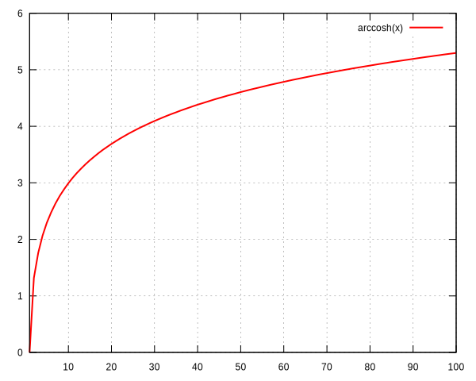
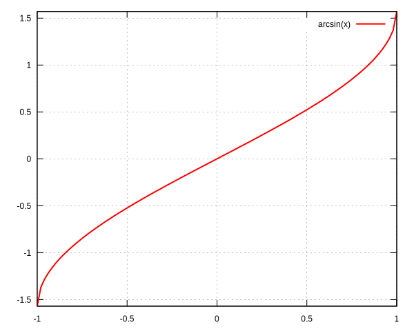
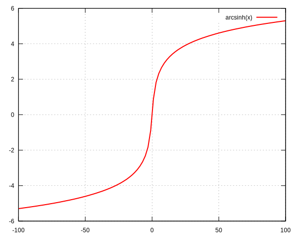

## acos
$\arccos$ function.
```freefem
real theta = acos(x);
```

<u>Parameter:</u>

 - x (real)

<u>Output:</u>

 - theta (real)


## acosh
$\DeclareMathOperator\arccosh{arccosh}$
$\arccosh$ function.
```freefem
real theta = acosh(x);
```

<u>Parameter:</u>

- x (real)

<u>Output:</u>

- theta (real)




## adaptmesh
Mesh adaptation function.
```freefem
mesh Thnew = adaptamesh(Th, f, ...)
```
> More complete example:

```freefem
mesh Thnew = adaptmesh(Th, [fx, fy], hmin=1.e-3, hmax=1.e-2, iso=false)
```

<u>Parameters:</u>

 - Th (mesh or mesh3)<br/>
 **Mesh to refine**
 - f (func), scalar or vectorial<br/>
 **Function to follow for the mesh adaptation**
 - _hmin=_ minh (real)<br/>
 **Minimum edge size**
 - _hmax=_ maxh (real)<br/>
 **Maximum edge size**
 - _err=_ Err (real)<br/>
 **Error level (P1 interpolation)**
 - _errg=_ Errg (real)<br/>
 **Relative geometrical error**
 - _nbvx=_ Nbvx (int)<br/>
 **Maximum number of vertices**
 - _nbsmooth=_ NbSmooth (int)<br/>
 **Number of smoothing iterations**
 - _nbjacoby=_ NbJacoby (int)<br/>
 **Number of iterations for the smoothing procedure**
 - _ratio=_ Ratio (real)<br/>
 **Ratio of the triangles**
 - _omega=_ Omega (real)<br/>
 **Relaxation parameter for the smoothing procedure**
 - _iso=_ Iso (bool)<br/>
 **Isotropic adaptation (if true)**
 - _abserror=_ AbsError (bool)<br/>
 **Error (if true) - Relative error (if false)**
 - _cutoff=_ CutOff (real)<br/>
 **Lower limit of the relative error evaluation**
 - _verbosity=_ Verbosity (real)<br/>
 **Verbosity level**
 - _inquire=_ Inquire (bool)<br/>
 **If true, inquire graphically**
 - _splitpbedge=_ SplitPbEdge (bool)<br/>
 **If true, split all internal edges in half**
 - _maxsubdiv=_ MaxSubdiv (int)<br/>
 **Bound the maximum subdivisions**
 - _rescaling=_ Rescaling (bool)<br/>
 **Rescale the function in [0, 1]**
 - _keepbackvertices=_ KeepBackVertices (bool)<br/>
 **If true, try to keep vertices of the original mesh**
 - _isMetric=_ IsMetric (bool)<br/>
 **If ture, the metric is defined explicitly**
 - _power=_ Power (int)<br/>
 **Exponent of the Hessian**
 - _thetamax=_ ThetaMax (int)<br/>
 **Minium corner angle (in degree)**
 - _splitin2=_ SplitIn2 (bool)<br/>
 **Split all triangles into 4 sub-triangles if true**
 - _metric=_ Metric ([real[int], real[int], real[int]])<br/>
 **Array of 3 real arrays defining the metric**
 - _nomeshgeneration=_ NoMeshGeneration (bool)<br/>
 **If true, the mesh is not generated**
 - _periodic=_ Periodic<br/>
 **Build an adapted periodic mesh**

<u>Output:</u>

 - Thnew (mesh or mesh3)

## adj
Adjacent triangle of the triangle $k$ by the edge $e$
```freefem
int T = Th[k].adj(e);
```
<u>Parameter:</u>

 - e (int)<br/>
 **Edge number**

<u>Output:</u>

 - T (int)<br/>
 **Triangle number**

## AffineCG
Affine conjugate gradient solver

Used to solve a problem like $Ax=b$

```freefem
int Conv = AffineCG(A, x, precon=Precon, nbiter=NbIter, eps=Eps, veps=VEps, stop=Stop);
```

<u>Parameter:</u>

 - A (matrix)<br/>
 **Matrix of the problem $Ax=b$**
 - x (real[int])<br/>
 **Solution vector**
 - _precon=_ Precon (real[int])<br/>
 **Preconditionning function**
 - _nbiter=_ NbIter (int)<br/>
 **Maximum number of iterations**
 - _eps=_ Eps (real)<br/>
 **Convergence criterion**<br/>
 If $\epsilon>0$: test $||A(x)||_p \leq \epsilon||A(x_0)||_p$<br/>
 If $\epsilon<0$: test $||A(x)||_p^2 \leq |\epsilon|$
 - _veps=_ VEps (real)<br/>
 **Same as eps, but return -eps**
 - _stop=_ Stop (func)<br/>
 **Convergence criterion as a function**<br/>
 Prototype is `:::freefem func bool StopFunc (int Iter, real[int] U, real[int] g)`<br/>
 `u`: current solution, `g`: current gradient (not preconditionned)

<u>Output:</u>

 - Conv (int)<br/>
 **0: converged - !0: not converged**

## AffineGMRES
Affine GMRES solver

Parameters and output are the same as [AffineCG](#affinecg)

## asin
$\arcsin$ function.
```freefem
real theta = asin(x);
```

<u>Parameter:</u>

 - x (real)

<u>Output:</u>

 - theta (real)



## asinh
$\DeclareMathOperator\arcsinh{arcsinh}$
$\arcsinh$ function.
```freefem
real theta = asinh(x);
```

<u>Parameter:</u>

 - x (real)

<u>Output:</u>

 - theta (real)



## assert
Verify a condition is true (same as C), if not the program stops.
```freefem
assert(x==0)
```

<u>Parameter:</u>

 - Bollean condition

<u>Output:</u>

 - None

## atan
$\arctan$ function.
```freefem
real theta = atan(x);
```

<u>Parameter:</u>

 - x (real)

<u>Output:</u>

 - theta (real)


## atan2
$\displaystyle{\arctan\left(\frac{y}{x}\right)}$ function, returning the correct sign for $\theta$.
```freefem
real theta = atan2(y, x)
```

<u>Parameter:</u>

 - x (real)

<u>Output:</u>

 - theta (real)

## atanh
$\DeclareMathOperator\arctanh{arctanh}$
$\arctanh$ function.
```freefem
real theta = atanh(x);
```

<u>Parameter:</u>

 - x (real)

<u>Output:</u>

 - theta (real)


## BFGS

>TODO

<u>Parameter:</u>

<u>Output:</u>


## buildlayers

>TODO

<u>Parameter:</u>

<u>Output:</u>


## buildmesh
Build a 2D mesh using border elements.
```freefem
mesh Th = buildmesh(b1(nn) + b2(nn) + b3(nn) + b4(nn), [nbvx=Nbvx], [fixeborder=FixeBorder]);
```

<u>Parameters:</u>

 - b1, b2, b3, b4 (border)<br/>
 **Geometry border, `b1(nn)` mean `b1` border discretize by `nn` vertices**
 - _nbvx=_ Nbvx (int) _[Optional]_<br/>
 **Maximum number of vertices**<br/>
 Default: >TODO
 - _fixeborder=_ FixeBorder (bool) _[Optional]_<br/>
 **If true, mesh genertator can not change the boundary mesh**<br/>
 Default: `false`

<u>Output:</u>

 - Th (mesh)<br/>
 **Resulting mesh**

## ceil
Round fractions up of $x$.
```freefem
int c = ceil(x);
```

<u>Parameter:</u>

 - x (real)

<u>Output:</u>

 - c (int)

## change
Change a property of a mesh.
```freefem
int[int] L = [0, 1];
Thnew = change(Th, label=L);
```

<u>Parameter:</u>

 - Th (mesh)<br/>
 **Original mesh**
 
 - _label=_ L (int[int])<br/>
 **Pair of old and new label**
 - _region=_ R (int[int])<br/>
 **Pair of old and new region**
 - _flabel=_ l (func int)<br/>
 **Function of int given the new label**
 - _fregion=_ r (func int)</br>
 **Function of int given the new region**

<u>Output:</u>

 - Thnew (mesh)
 **Mesh with chenged parameters**

## checkmovemesh
Check a `movemesh` without mesh generation.

>TODO

<u>Parameter:</u>

<u>Output:</u>

## clock
Get the clock in second.
```freefem
real t = clock();
```

<u>Parameter:</u>

 - None

<u>Output:</u>

 - t (real)<br/>
 **Current CPU time**

## cmaes

>TODO

<u>Parameter:</u>

<u>Output:</u>


## conj
Caculate the conjuguate of a complex number.
```freefem
complex C1 = 1 + 1i;
complex C2 = conj(C1);
```

<u>Parameter:</u>

 - C1 (complex)<br/>
 **Complex number**

<u>Output:</u>

 - C2 (complex)<br/>
 **Conjuguate of C1**

## convect
Characteristic Galerkin method.
```freefem
convect([ux, uy], dt, c);
```

>TODO

<u>Parameter:</u>

<u>Output:</u>


## cos
$\cos$ function.

```freefem
real x = cos(theta);
```

<u>Parameters:</u>

 - theta (real)

<u>Output:</u>

 - x (real)


## cosh

$\cosh$ function.

```freefem
real x = cosh(theta);
```

<u>Parameters:</u>

 - theta (real)

<u>Output:</u>

 - x (real)

## cube
Construct a cubic mesh.

Need:
```freefem
include "cube.idp"
```

```freefem
mesh3 Th = cube(nnX, nnY, nnZ, [X(x), Y(y), Z(z)], [label=Label], [flags=Flags], [region=Region]);
```

<u>Parameters:</u>

 - nnX (int)<br/>
 **Number of discretization point along $x$**
 - nnY (int)<br/>
 **Number of discretization point along $y$**
 - nnZ (int)<br/>
  **Number of discretization point along $z$**
  - X(x) (func) _[Optional]_<br/>
  **Affine function of $x$ to define the length**<br/>
  Default: `x`
  - Y(y) (func) _[Optional]_<br/>
  **Affine function of $y$ to define the width**<br/>
  Default: `y`
  - Z(z) (func) _[Optional]_<br/>
  **Affine function of $z$ to define the height**<br/>
  Default: `z`
  - _label=_ Label (int[int]) _[Optional]_<br/>
  **List of surface labels**<br/>
  Default: `[1, 2, 3, 4, 5, 6]`
  - _flags=_ Flags (int) _[Optional]_<br/>
  **Refer to [square](#square)**
  - _region=_ Region (int) _[Optional]_<br/>
  **Region number of the cube volume**
  Default: `0`

<u>Output:</u>

 - Th (mesh3)<br/>
 **Cube mesh**

## dfft

>TODO

## diffnp
Arithmetic useful function.
```freefem
diffnp(a, b) = (a<0)&(0<b) ? (b-a) : 0;
```

## diffpos
Arithmetic useful function.
```freefem
diffpos(a, b) = max(b-a, 0);
```

## dist
Arithmetic useful function.
```freefem
dist(a, b, c) = sqrt(a^2 + b^2 + c^2);
```

## EigenValue

>TODO

## emptymesh
Build an empty mesh.

Useful to handle Lagrange multipliers in mixed and Mortar methods.
```freefem
mesh eTh = emptymesh(Th, ssd);
```

<u>Parameters:</u>

 - Th (mesh<br/>
 **Mesh to empty**
 - ssd (int[int])<br/>
 **>TODO**

<u>Output:</u>

 - eTh (mesh)<br/>
 **Empty mesh**

## erf
The error function:
$$
erf(x) = \frac{2}{\sqrt{pi}}\int_{0}^{x}{\exp(-t^2)dt}
$$
```freefem
real err = erf(x);
```

<u>Parameters:</u>

 - x (real)

<u>Output:</u>

 - err (real)

## erfc
Complementary of the [error function](#erf):
$$
erfc(x) = 1-erf(x)
$$
```freefem
real errc = erfc(x);
```

<u>Parameters:</u>

 - x (real)

<u>Output:</u>

 - err (real)

## exec
Execute an external command.
```freefem
int v = exec(command);
```

<u>Parameters:</u>

 - command (string)<br/>
 **Command to execute**

<u>Output:</u>

 - v (int)<br/>
 **Value returned by the command**

## exit
Exit function, equivalent to `return`.
```freefem
exit(N);
```

<u>Parameters:</u>

 - N (int)<br/>
 **Return value**

<u>Output:</u>

 - None

## exp
Exponential function.
```freefem
real a = exp(b);
```

<u>Parameters:</u>

 - b (real)

<u>Output:</u>

 - a (real)

## fdim
Positive difference (`cmath` function).
```freefem
real fd = fdim(a, b);
```

<u>Parameters:</u>

 - a (real)
 - b (real)

<u>Output:</u>

 - fd (real)<br/>
 **If $x > y$, return $x-y$**<br/>
 **If $x \leq y$, return $0$**

## floor
Floor function.
```freefem
real a = floor(b);
```
Return the largest integer value not greater than `b`.

<u>Parameters:</u>

 - b (real)

<u>Output:</u>

 - a (real)

## fmax
Maximum (`cmath` function).
```freefem
real Max = fmax(a, b);
```

<u>Parameters:</u>

 - a (real)
 - b (real)

<u>Output:</u>

 - Max (real)

## fmin
Minimum (`cmath` function).
```freefem
real Min = fmin(a, b);
```

<u>Parameters:</u>

 - a (real)
 - b (real)

<u>Output:</u>

 - Min (real)

## fmod
Remainder of $a/b$ (`cmath` function).
```freefem
real Mod = fmin(a, b);
```

<u>Parameters:</u>

 - a (real)
 - b (real)

<u>Output:</u>

 - Min (real)

<u>Parameters:</u>

 - a (real)
 - b (real)

<u>Output:</u>

 - Mod (real)

## imag
Imaginary part of a complex number.
```freefem
complex c = 1. + 1i;
real Im = imag(c);
```

## int1d
1D integral.
```freefem
int1d(Th, [Label], [qfe=Qfe], [qforder=Qforder])(
	...
)
```
Used in [problem](types/#problem), [solve](types/#solve) or [varf](types/#varf) definition to impose a boundary condition only (FreeFem++ does not support 1D simulation).

<u>Parameters:</u>

 - Th (mesh)<br/>
 **Mesh where the integral is calculated**
 - Gamma (int) _[Optional]_<br/>
 **Label of the 1D border**<br/>
 Default: all borders of the mesh
 - _qfe=_ Qfe (keyword) _[Optional]<br/>
 **Quadrature formula, see [quadrature formulae](quadrature/#int1d)**
 - _qforder=_ Qforder (keyword) _[Optional]_<br/>
 **Quadrature order, see [quadrature formulae](quadrature/#int1d)**

<u>Output:</u>

 - Non relevant

!!!note ""
    The content of `int1d` must be a linear or bilinear form.

## int2d
2D integral.
```freefem
int2d(Th, [Region], [qfe=Qfe], [qforder=Qforder])(
	...
)
```
Or
```freefem
int2d(Th, [Label], [qfe=Qfe], [qforder=Qforder])(
	...
)
```
Used in [problem](types/#problem), [solve](types/#solve) or [varf](types/#varf) definition to:
 - Calculate integral in 2D simulation
 - Impose a boundary condition in 3D simulation

<u>Parameters:</u>

 - Th (mesh)<br/>
 **Mesh where the integral is calculated**
 - Region (int) _[Optional]_<br/>
 **Label of the 2D region (2D simulation)**<br/>
 Default: all regions of the mesh
 - Gamma (int) _[Optional]_<br/>
 **Label of the 2D border (3D simulation)**<br/>
 Default: all borders of the mesh
 - _qfe=_ Qfe (keyword) _[Optional]<br/>
 **Quadrature formula, see [quadrature formulae](quadrature/#int2d)**
 - _qforder=_ Qforder (keyword) _[Optional]_<br/>
 **Quadrature order, see [quadrature formulae](quadrature/#int2d)**

<u>Output:</u>

 - Non relevant

!!!note ""
    The content of the `int2d` must be a linear or bilinear form.

## int3d
3D integral.
```freefem
int3d(Th, [Region], [qfe=Qfe], [qforder=Qforder])(
	...
)
```
Used in [problem](types/#problem), [solve](types/#solve) or [varf](types/#varf) definition to calculate integral in 3D simulation.

<u>Parameters:</u>

 - Th (mesh)<br/>
 **Mesh where the integral is calculated**
 - Region (int) _[Optional]_<br/>
 **Label of the 3D region**<br/>
 Default: all regions of the mesh
 - _qfe=_ Qfe (keyword) _[Optional]<br/>
 **Quadrature formula, see [quadrature formulae](quadrature/#int3d)**
 - _qforder=_ Qforder (keyword) _[Optional]_<br/>
 **Quadrature order, see [quadrature formulae](quadrature/#int3d)**

<u>Output:</u>

 - Non relevant

!!!note ""
    The content of the `int3d` must be a linear or bilinear form.

## intalledges

>TODO

## interpolate
Interpolation matrix.
```freefem
matrix I = interpolate(Vh, Wh, inside=Inside, t=T, op=Op, U2Vc=U2VC);
```
>TODO

## invdiffnp
Arithmetic useful function.
```freefem
invdiffnp(a, b) = (a<0)&(0<b) ? 1/(b-a) : 0
```

## invdiffpos
Arithmetic useful function.
```freefem
invdiffpos(a, b) = (a<b) ? 1./(b-a) : 0
```

## isoline
Need:
```freefem
load "isoline"
```

```freefem
int N = isoline(Th, u, xy, iso=Iso, close=Close, smoothing=Smoothing, ratio=Ratio, eps=Eps, beginend=BeginEnd, file=File);
```

>TODO

## j0

>TODO

## j1

>TODO

## jn

>TODO

## jump

>TODO

## LinearCG

>TODO

## LinearGMRES

>TODO

## log

>TODO

## log10

>TODO

## max

>TODO

## mean

>TODO

## medit

>TODO

## min

>TODO

## movemesh

>TODO

## movemesh23

>TODO

## NLCG

>TODO

## on

>TODO

## plot

>TODO

## polar

>TODO

## pow
Power function.
```freefem
real p = pow(a, b);
```
$p=a^b$

<u>Parameters:</u>

 - a (real)
 - b (real)

<u>Output:</u>

 - p (real)

## projection
Arithmetic useful function.
```freefem
projection(a, b, x) = min(max(a, x), b);
```

## readmesh

>TODO

## readmesh3

>TODO

## round

>TODO

## savemesh

>TODO

## savesol

>TODO

## set

>TODO

## sin

>TODO

## sinh

>TODO

## sort

>TODO

## splitmesh

>TODO

## square

>TODO

## tan

>TODO

## tanh

>TODO

## tetg

>TODO

## tetgconvexhull

>TODO

## tetgreconstruction

>TODO

## tetgtransfo

>TODO

## trunc

>TODO

## y0

>TODO

## y1

>TODO

## yn

>TODO
