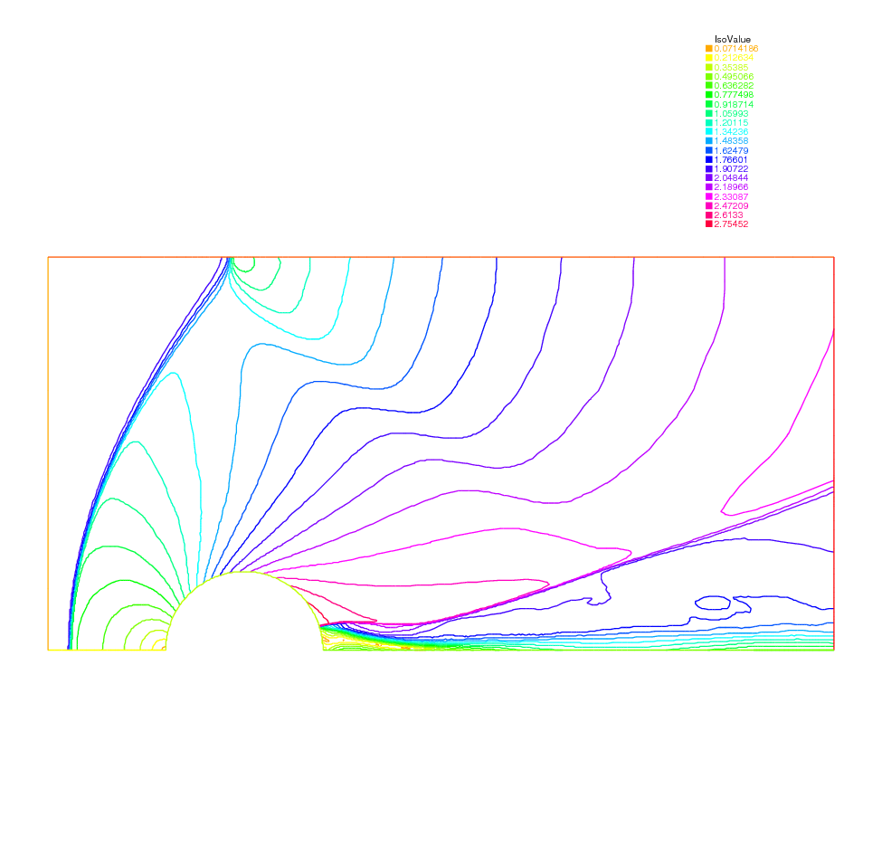

# A Flow with Shocks

Compressible Euler equations should be discretized with Finite Volumes or FEM with flux up-winding scheme but these are not implemented in FreeFem++. Nevertheless acceptable results can be obtained with the method of characteristics provided that the mean values $\bar f=\frac12(f^++f^-)$ are used at shocks in the scheme, and finally mesh adaptation.

\begin{eqnarray}\label{euler}
	\p_t\rho+\bar u\n\rho + \bar\rho\n\cdot u &=& 0\nonumber\\
	\bar\rho( \p_t u+\frac{\overline{\rho u}}{\bar\rho}\n u +\n p &=& 0\nonumber\\
	\p_t p + \bar u\n p +(\gamma-1)\bar p\n\cdot u &=& 0\\
\end{eqnarray}

One possibility is to couple $u,p$ and then update $\rho$, i.e.

\begin{eqnarray}\label{eulalgo}
	\frac 1{(\gamma-1)\delta t\bar p^m} (p^{m+1}-p^m \circ X^m) + \n\cdot u^{m+1} &=& 0\nonumber\\
	\frac{\bar\rho^m}{\delta t}(u^{m+1}-u^m \circ {\tilde X}^m ) +\n p^{m+1} &=& 0\nonumber\\
	\rho^{m+1} = \rho^m \circ X^m + \frac{\bar\rho^m}{(\gamma-1)\bar p^m}(p^{m+1}-p^m &\circ& X^m)
\end{eqnarray}

A numerical result is given on [figure 1](#Fig1) and the FreeFem++ script is

```freefem
// Parameters
verbosity = 1;
int anew = 1;
int m = 5;
real x0 = 0.5;
real y0 = 0.;
real rr = 0.2;
real dt = 0.01;
real u0 = 2.;
real err0 = 0.00625;
real pena = 2.;

// Mesh
border ccc(t=0, 2){x=2-t; y=1;};
border ddd(t=0, 1){x=0; y=1-t;};
border aaa1(t=0, x0-rr){x=t; y=0;};
border cercle(t=pi, 0){x=x0+rr*cos(t); y=y0+rr*sin(t);}
border aaa2(t=x0+rr, 2){x=t; y=0;};
border bbb(t=0, 1){x=2; y=t;};

 mesh Th;
if(anew)
	Th = buildmesh (ccc(5*m) + ddd(3*m) + aaa1(2*m) + cercle(5*m) + aaa2(5*m) + bbb(2*m));
else
	Th = readmesh("Th_circle.mesh"); plot(Th);

// fespace
fespace Wh(Th, P1);
Wh u, v;
Wh u1, v1;
Wh uh, vh;

fespace Vh(Th, P1);
Vh r, rh, r1;

// Macro
macro dn(u) (N.x*dx(u)+N.y*dy(u)) //

// Initialization
if(anew){
	u1 = u0;
	v1 = 0;
	r1 = 1;
}
else{
	ifstream g("u.txt"); g >> u1[];
	ifstream gg("v.txt"); gg >> v1[];
	ifstream ggg("r.txt"); ggg >> r1[];
	plot(u1, ps="eta.eps", value=1, wait=1);
	err0 = err0/10;
	dt = dt/10;
}

// Problem
problem euler(u, v, r, uh, vh, rh)
	= int2d(Th)(
		  (u*uh + v*vh + r*rh)/dt
		+ ((dx(r)*uh + dy(r)*vh) - (dx(rh)*u + dy(rh)*v))
	)
	+ int2d(Th)(
		- (
			  rh*convect([u1,v1],-dt,r1)
			+ uh*convect([u1,v1],-dt,u1)
			+ vh*convect([u1,v1],-dt,v1)
		)/dt
	)
	+int1d(Th, 6)(
		  rh*u
	)
	+ on(2, r=0)
	+ on(2, u=u0)
	+ on(2, v=0)
	;

// Iterations
int j = 80;
for(int k = 0; k < 3; k++){
	if(k==20){
		err0 = err0/10;
		dt = dt/10;
		j = 5;
	}

	// Solve
	for(int i = 0; i < j; i++){
		euler;
		u1=u;
		v1=v;
		r1=abs(r);
		cout << "k = " << k << " E = " << int2d(Th)(u^2+v^2+r) << endl;
		plot(r, value=1);
	}

	// Mesh adaptation
	Th = adaptmesh (Th, r, nbvx=40000, err=err0, abserror=1, nbjacoby=2, omega=1.8, ratio=1.8, nbsmooth=3, splitpbedge=1, maxsubdiv=5, rescaling=1);
	plot(Th);
	u = u;
	v = v;
	r = r;

	// Save
	savemesh(Th, "Th_circle.mesh");
	ofstream f("u.txt"); f << u[];
	ofstream ff("v.txt"); ff << v[];
	ofstream fff("r.txt"); fff << r[];
	r1 = sqrt(u*u+v*v);
	plot(r1, ps="mach.eps", value=1);
	r1 = r;
}
```

|<a name="Fig1">Fig. 1</a>: Pressure for a Euler flow around a disk at Mach 2 computed by \eqref{eulalgo}|
|:----|
||
