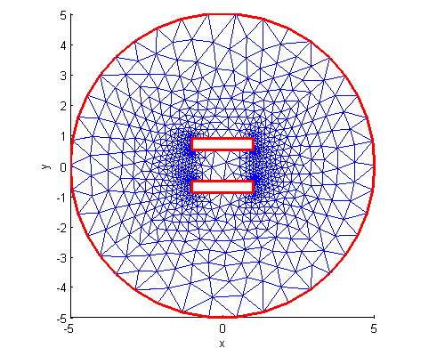
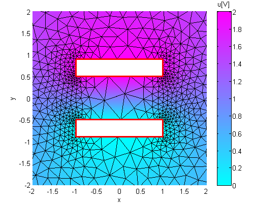
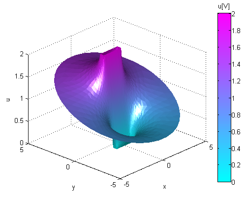
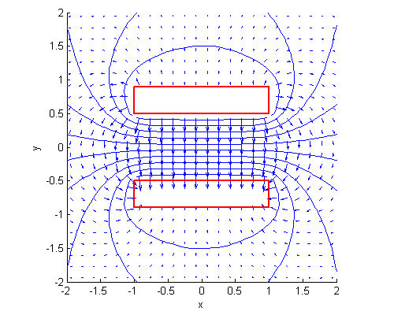
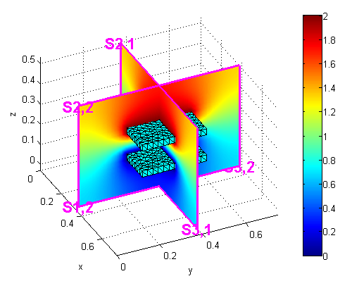

# Plotting in Matlab and Octave

This chapter is about plotting FreeFem++ simulation results with [Matlab&copy; ](https://www.mathworks.com/) and [Octave](https://www.gnu.org/software/octave/).

## Overview

In order to create a plot of FreeFem++ simulation results in Matlab / Octave two steps are necessary:

  * The mesh and the FE-space functions must be exported to text files
  * The text files have to be imported into Matlab / Octave and plotted with the [ffmatlib commands](https://github.com/samplemaker/freefem_matlab_octave_plot)

Both steps are explained in more detail below using the example of a stripline capacitor.

!!! info
	To be able to call `ffmatlib` commands the path name of the `ffmatlib` must be added to the search path with the command `'addpath('Path to ffmatlib')'`.

## 2D Problem

To create some example simulation data consider the problem of a stripline capacitor which is also shown in [figure 1](#Fig1). On the two boundaries (the electrodes) $C_{A}$, $C_{K}$ a dirichlet condition and on the enclosure $C_{B}$ a Neumann condition is set. The electrostatic potential $u$ between the two electrodes is given by the Laplace equation

\begin{eqnarray}
	\Delta u(x,y) = 0
\end{eqnarray}

and the electrostatic field is calculated by

\begin{eqnarray}
	\mathbf{E} = -\nabla u
\end{eqnarray}

```freefem
int CA=3, CK=4, CB=5;
real w2=1.0, h=0.4, d2=0.5;

border bottomA(t=-w2,w2){ x=t; y=d2; label=CA;};
border rightA(t=d2,d2+h){ x=w2; y=t; label=CA;};
border topA(t=w2,-w2){ x=t; y=d2+h; label=CA;};
border leftA(t=d2+h,d2){ x=-w2; y=t; label=CA;};

border bottomK(t=-w2,w2){ x=t; y=-d2-h; label=CK;};
border rightK(t=-d2-h,-d2){ x=w2; y=t; label=CK;};
border topK(t=w2,-w2){ x=t; y=-d2; label=CK;};
border leftK(t=-d2,-d2-h){ x=-w2; y=t; label=CK;};

border enclosure(t=0,2*pi){x=5*cos(t); y=5*sin(t); label=CB;}

int n=15;
mesh Th = buildmesh(enclosure(3*n)+
             bottomA(-w2*n)+topA(-w2*n)+rightA(-h*n)+leftA(-h*n)+
             bottomK(-w2*n)+topK(-w2*n)+rightK(-h*n)+leftK(-h*n));

fespace Vh(Th,P1);

Vh u,v;
real u0=2.0;

problem Laplace(u,v,solver=LU) =
          int2d(Th)(dx(u)*dx(v) + dy(u)*dy(v))
        + on(CA,u=u0)+on(CK,u=0);

real error=0.01;
for (int i=0;i<1;i++){
   Laplace;
   Th=adaptmesh(Th,u,err=error);
   error=error/2.0;
}
Laplace;

Vh Ex, Ey;
Ex = -dx(u);
Ey = -dy(u);

plot(u,[Ex,Ey],wait=true);
```

## Exporting Data

To export a FEM mesh FreeFem++ offers the [savemesh()](../documentation/MeshGeneration/#data-structures-and-readwrite-statements-for-a-mesh) command. FE-space functions must be written to text files by for-loops. The following code section writes the mesh, the potential $u$ and the 2D vector field $\mathbf{E}$ of the stripline capacitor example into three different files:

```freefem
//Stores the Mesh
savemesh(Th,"capacitor.msh");

//Stores the potential u
{
ofstream file("capacitor_potential.txt");
for (int j=0; j<u[].n; j++)
   file << u[][j] << endl;
}

//Stores the 2D vector field
{
ofstream file("capacitor_field.txt");
for (int j=0; j<Ex[].n; j++)
   file << Ex[][j] << " " << Ey[][j] << endl;
}
```

## Importing Data

A mesh file as previously written with the `savemesh(Th,"filename.msh")` command consists of [three main sections](../documentation/MeshGeneration/#data-structures-and-readwrite-statements-for-a-mesh):

1. The mesh points as nodal coordinates  
2. A list of boundary edges including boundary labels  
3. List of triangles defining the mesh in terms of connectivity  

A mesh file is loaded to the Matlab / Octave workspace with the following command:

```Matlab
[p,b,t,nv,nbe,nt,labels] = ffreadmesh('filename.msh');
```

The three data sections mentioned are stored in the variables `p`, `b` and `t`. On the other hand the simulation data can be loaded into the Matlab / Octave workspace with the function:

```Matlab
u = ffreaddata('filename.txt');
```

Therefore to load the complete simulation result from the capacitor example the following statement sequence must be executed:

```Matlab
%Where to find the ffmatlib commands
addpath('ffmatlib');
%Loads the mesh
[p,b,t,nv,nbe,nt,labels]=ffreadmesh('capacitor.msh');
%Loads scalar data
[u]=ffreaddata('capacitor_potential.txt');
%Loads vector field data
[Ex,Ey]=ffreaddata('capacitor_field.txt');
```

## 2D Plot Examples

`ffpdeplot()` is a plot solution for creating patch, contour, quiver, border, and mesh plots of 2D geometries. The basic syntax is:

```Matlab
[handles,varargout] = ffpdeplot(p,b,t,varargin)
```

`varargin` specifies parameter name / value pairs to control the plot behaviour. A table showing all options can be found in the [ffmatlib documentation](https://github.com/samplemaker/freefem_matlab_octave_plot).

  * Plot of the boundary and the mesh:

```Matlab
ffpdeplot(p,b,t,'Mesh','on','Boundary','on');
```

<center>

|<a name="Fig1">Fig. 1:</a> Boundary and Mesh|
|:----:|
||

</center>

  * Patch plot (2D map or density plot) including mesh and boundary:

```Matlab
ffpdeplot(p,b,t,'XYData',u,'Mesh','on','Boundary','on', ...
          'XLim',[-2 2],'YLim',[-2 2]);
```

<center>

|<a name="Fig2">Fig. 2:</a> Patch Plot with Mesh|
|:----:|
||

</center>

  * 3D surf plot:

```Matlab
ffpdeplot(p,b,t,'XYData',u,'ZStyle','continuous','Mesh','off');
lighting gouraud;
view([-47,24]);
camlight('headlight');
```

<center>

|<a name="Fig3">Fig. 3:</a> 3D Surf Plot|
|:----:|
||

</center>

  * Contour (isovalue) and quiver (vector field) plot:

```Matlab
ffpdeplot(p,b,t,'XYData',u,'XYStyle','off','Mesh','off','Boundary','on', ...
          'Contour','on','CStyle','monochrome','CColor','b', ...
          'CGridParam',[150, 150],'FlowData',[Ex,Ey],'FGridParam',[24, 24], ...
          'ColorBar','off','XLim',[-2 2],'YLim',[-2 2]);
```

<center>

|<a name="Fig4">Fig. 4:</a> Contour and Quiver Plot|
|:----:|
||

</center>


**Download run through example:**  
[Matlab / Octave file](../tutorial/scripts/matlab_octave_2d_examples.m)  
[FreeFem++ script](../tutorial/scripts/matlab_octave_2d_examples.edp)

## 3D Plot Examples

A 3D plot command `ffpdeplot3D()` is under development. Note: The interface is not yet frozen and can still change.

The following example shows a slicing feature on a three-dimensional parallel plate capacitor.

<center>

|<a name="Fig5">Fig. 5:</a> Slice on a 3D Parall Plate Capacitor|
|:----:|
||

</center>

**Download run through example:**  
[Matlab / Octave file](../tutorial/scripts/matlab_octave_3d_examples.m)  
[FreeFem++ script](../tutorial/scripts/matlab_octave_3d_examples.edp)

## References

  * [Octave][octave]
  * [Matlab][matlab]
  * [ffmatlib][ffmatlib]

[ffmatlib]:   https://github.com/samplemaker/freefem_matlab_octave_plot
             "Interface to plot FreeFem++ results in Matlab / Octave"
[octave]:     https://www.gnu.org/software/octave/
             "GNU Octave scientific programming language"
[matlab]:     https://www.mathworks.com/
             "Matlab scientific programming language"

