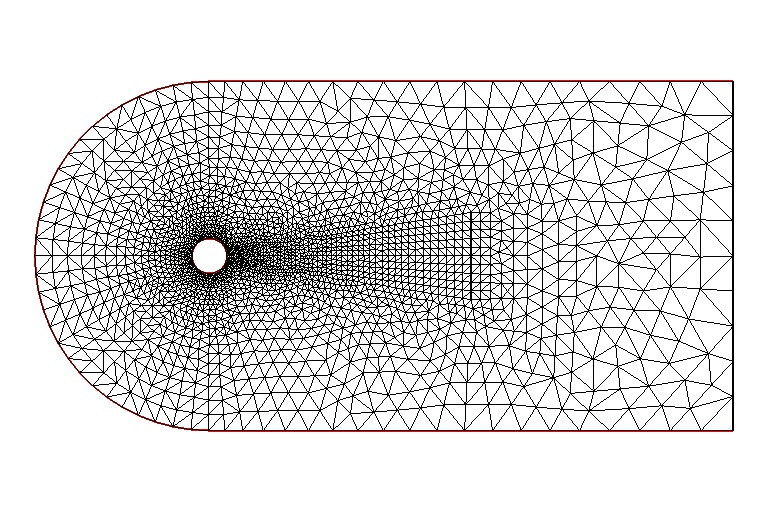
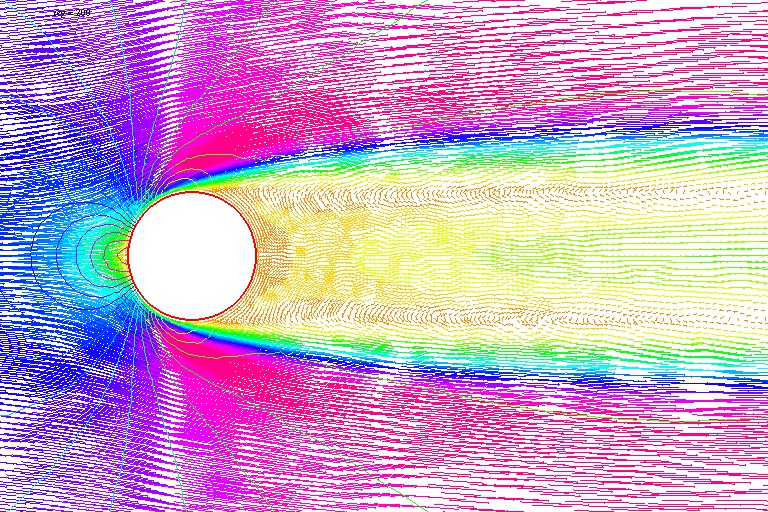

# Newton Method for the Steady Navier-Stokes equations

The problem is find the velocity field $\mathbf{u}=(u_i)_{i=1}^d$ and the pressure $p$ of a Flow satisfying in the domain $\Omega \subset \mathbb{R}^d (d=2,3)$:

\begin{eqnarray*}
(\mathbf{u}\cdot\nabla) \mathbf{u}-\nu \Delta \mathbf{u}+\nabla p&=&0\\
	\nabla\cdot \mathbf{u}&=&0
\end{eqnarray*}

where $\nu$ is the viscosity of the fluid, $\nabla = (\p_i )_{i=1}^d $, the dot product is $\cdot$, and $\Delta = \nabla\cdot\nabla$ with the some boundary conditions ( $\mathbf{u}$ is  given on $\Gamma$)

The weak form is
find $\mathbf{u}, p $ such than for $\forall \mathbf{v}$ (zero on $\Gamma$), and $\forall  q$

\begin{equation}
\int_\Omega  ((\mathbf{u}\cdot\nabla) \mathbf{u} ). \mathbf{v} + \nu \nabla \mathbf{u}:\nabla \mathbf{v}
- p \nabla\cdot \mathbf{v} - q \nabla\cdot \mathbf{u} = 0
\end{equation}

The Newton Algorithm to solve nonlinear problem is

Find $u\in V$ such that $F(u)=0$ where
$ F : V \mapsto V $.

1. choose $u_0\in \R^n $ , ;
2. for ( $i =0$; $i$ < niter; $i = i+1$)
	1. solve $DF(u_i) w_i = F(u_i)$;
	2. $u_{i+1} = u_i - w_i$;

break $|| w_i|| < \varepsilon$.


Where $DF(u)$ is the differential of $F$ at point $u$, this is a linear application such that:

$
F(u+\delta) = F(u) + DF(u) \delta + o(\delta)
$

For Navier Stokes, $F$ and $DF$ are :

\begin{eqnarray*}
F(\mathbf{u},p) = \int_\Omega &&((\mathbf{u}\cdot\nabla) \mathbf{u} ). \mathbf{v} + \nu \nabla \mathbf{u}:\nabla \mathbf{v}
 - p \nabla\cdot \mathbf{v} - q \nabla\cdot \mathbf{u}\\
DF(\mathbf{u},p)(\mathbf{\delta u} ,\delta p) = \int_\Omega &&((\mathbf{\delta u}\cdot\nabla) \mathbf{u} ). \mathbf v + ((\mathbf{u}\cdot\nabla) \mathbf{\delta u} ). \mathbf{v} \\
 &+& \nu \nabla \mathbf{\delta u}:\nabla \mathbf{v} - \delta p \nabla\cdot \mathbf{v} - q \nabla\cdot \mathbf{\delta u}
\end{eqnarray*}

So the Newton algorithm become
```freefem
// Parameters
real R = 5.;
real L = 15.;

real nu = 1./50.;
real nufinal = 1/200.;
real cnu = 0.5;

real eps = 1e-6;

verbosity = 0;

// Mesh
border cc(t=0, 2*pi){x=cos(t)/2.; y=sin(t)/2.; label=1;}
border ce(t=pi/2, 3*pi/2){x=cos(t)*R; y=sin(t)*R; label=1;}
border beb(tt=0, 1){real t=tt^1.2; x=t*L; y=-R; label=1;}
border beu(tt=1, 0){real t=tt^1.2; x=t*L; y=R; label=1;}
border beo(t=-R, R){x=L; y=t; label=0;}
border bei(t=-R/4, R/4){x=L/2; y=t; label=0;}
mesh Th = buildmesh(cc(-50) + ce(30) + beb(20) + beu(20) + beo(10) + bei(10));
plot(Th);

//bounding box for the plot
func bb = [[-1,-2],[4,2]];

// Fespace
fespace Xh(Th, P2);
Xh u1, u2;
Xh v1,v2;
Xh du1,du2;
Xh u1p,u2p;

fespace Mh(Th,P1);
Mh p;
Mh q;
Mh dp;
Mh pp;

// Macro
macro Grad(u1,u2) [dx(u1), dy(u1), dx(u2),dy(u2)] //
macro UgradV(u1,u2,v1,v2) [[u1,u2]'*[dx(v1),dy(v1)],
						[u1,u2]'*[dx(v2),dy(v2)]] //
macro div(u1,u2) (dx(u1) + dy(u2)) //

// Initialization
u1 = (x^2+y^2) > 2;
u2 = 0;

// Viscosity loop
while(1){
	int n;
	real err=0;
	// Newton loop
	for (n = 0; n < 15; n++){
		// Newton
		solve Oseen ([du1, du2, dp], [v1, v2, q])
			= int2d(Th)(
					nu * (Grad(du1,du2)' * Grad(v1,v2))
				+ UgradV(du1,du2, u1, u2)' * [v1,v2]
				+ UgradV( u1, u2,du1,du2)' * [v1,v2]
				- div(du1,du2) * q
				- div(v1,v2) * dp
				- 1e-8*dp*q //stabilization term
			)
			- int2d(Th) (
					nu * (Grad(u1,u2)' * Grad(v1,v2))
				+ UgradV(u1,u2, u1, u2)' * [v1,v2]
				- div(u1,u2) * q
				- div(v1,v2) * p
			)
			+ on(1, du1=0, du2=0)
			;

		u1[] -= du1[];
		u2[] -= du2[];
		p[] -= dp[];

		real Lu1=u1[].linfty, Lu2=u2[].linfty, Lp=p[].linfty;
		err = du1[].linfty/Lu1 + du2[].linfty/Lu2 + dp[].linfty/Lp;

		cout << n << " err = " << err << " " << eps << " rey = " << 1./nu << endl;
		if(err < eps) break; //converge
		if( n>3 && err > 10.) break; //blowup
	}

	if(err < eps){	//converge: decrease $\nu$ (more difficult)
		// Plot
		plot([u1, u2], p, wait=1, cmm=" rey = " + 1./nu , coef=0.3, bb=bb);

		// Change nu
		if( nu == nufinal) break;
		if( n < 4) cnu = cnu^1.5; //fast converge => change faster
		nu = max(nufinal, nu* cnu); //new viscosity

		// Update
		u1p = u1;
		u2p = u2;
		pp = p;
	}
	else{	//blowup: increase $\nu$ (more simple)
		assert(cnu< 0.95); //the method finally blowup

		// Recover nu
		nu = nu/cnu;
		cnu= cnu^(1./1.5); //no conv. => change lower
		nu = nu* cnu; //new viscosity
		cout << " restart nu = " << nu << " Rey = " << 1./nu << " (cnu = " << cnu << " ) \n";

		// Recover a correct solution
		u1 = u1p;
		u2 = u2p;
		p = pp;
	}
}
```

!!!note
	We use a trick to make continuation on the viscosity $\nu$, because the Newton method blowup owe start with the final viscosity $\nu$.

	$nu$ is gradually increased to the desired value.

|<a name="Fig1">Fig. 1</a>: Mesh and the velocity and pressure at Reynolds 200|
|:----:|
||
||
