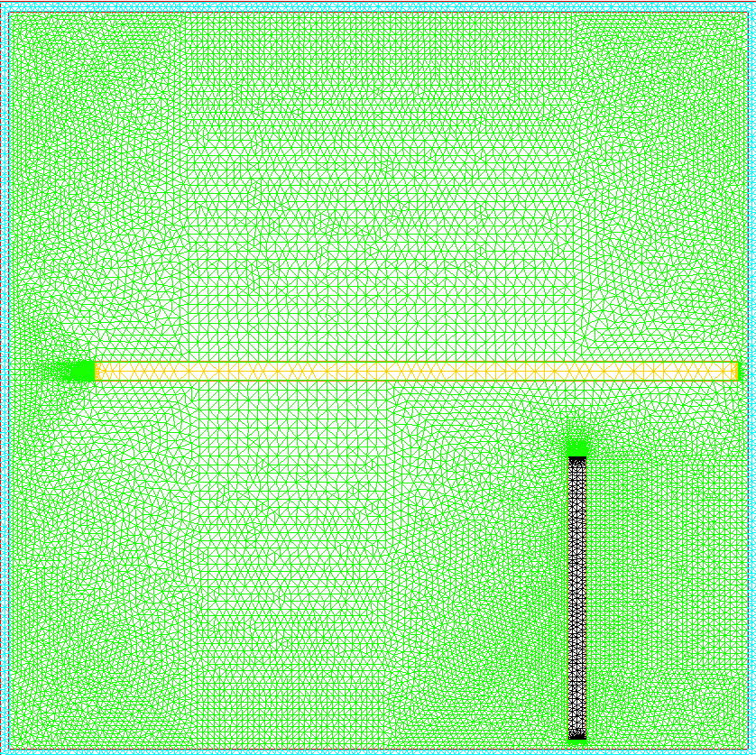
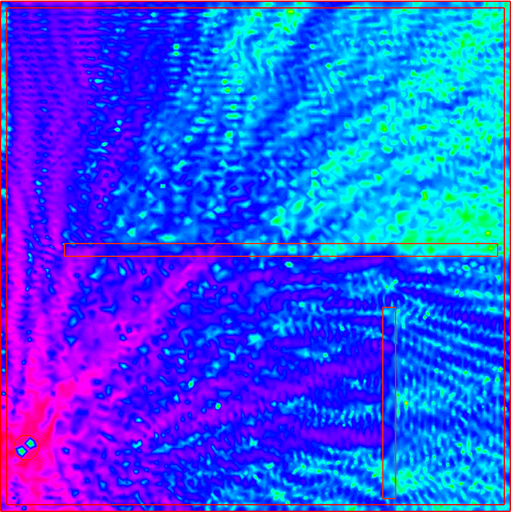
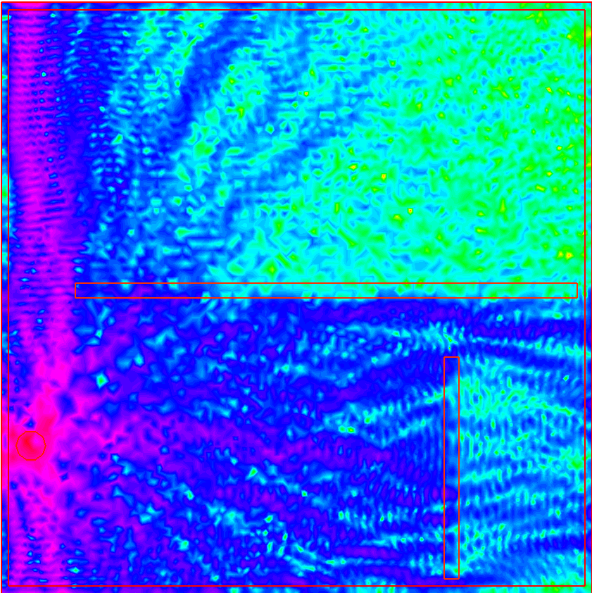
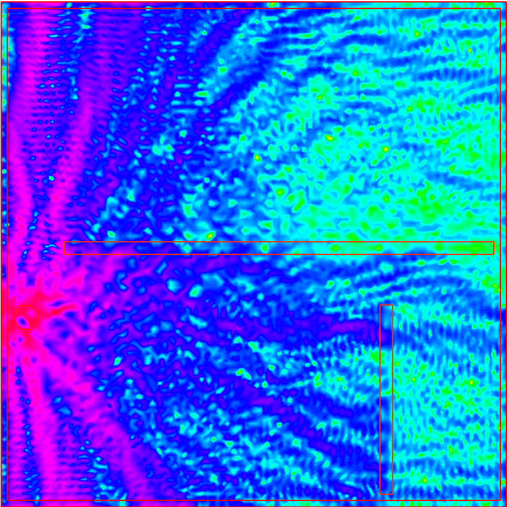
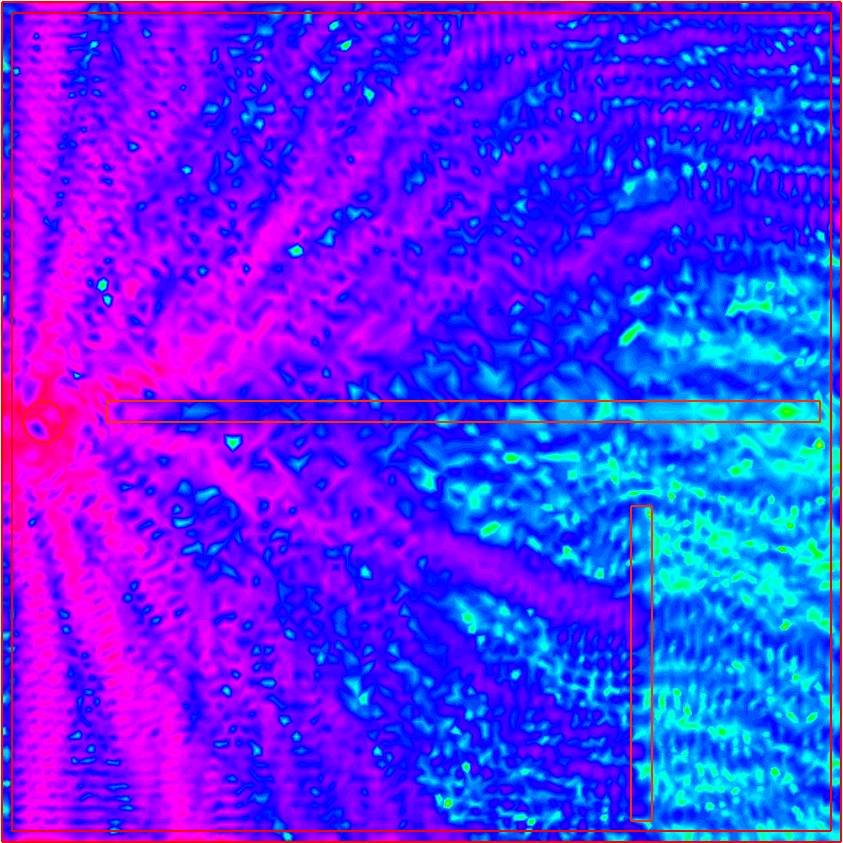
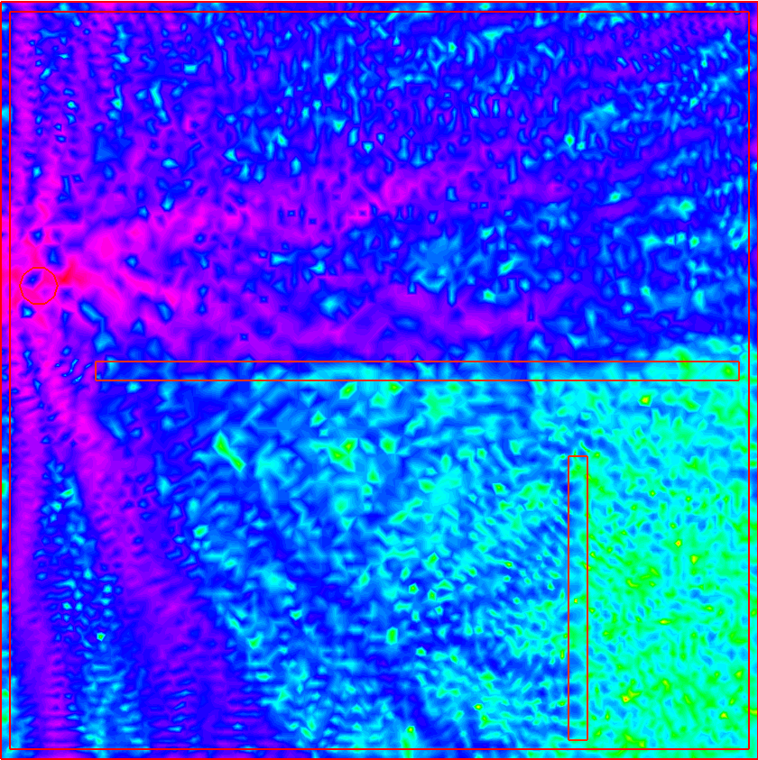
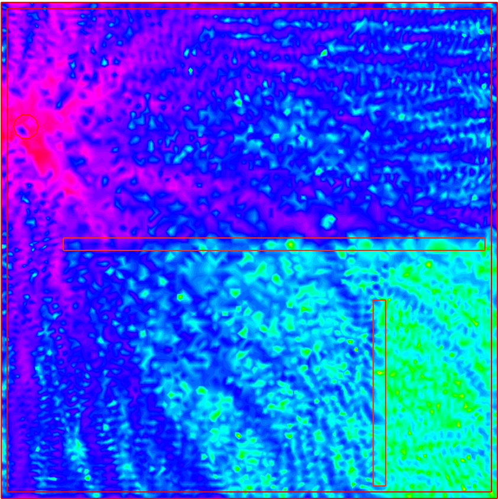
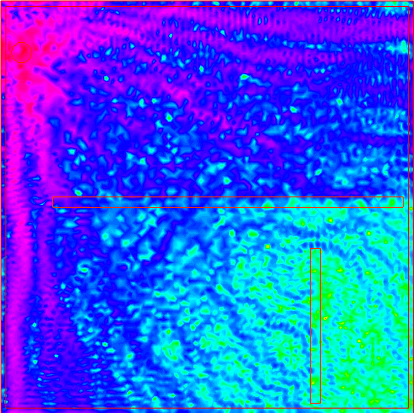

# Wifi Propagation

## Summary

In this tutorial, we will study the wifi signal power in a flat. An awesome flat is especially designed for the experiment, with **2** walls :

<center>

|Figure 1 - Flat |
|:-------------------------:|
||

</center>

Even if the flat seems small enough to be covered by wifi everywhere, it is still interesting to study where the signal's power is the lowest. We will study where to put the hotspot to get the best coverage, and as we're a bit lazy we will only put it next to the left wall.

## Physics

In a nutshell, the Wifi is a electromagnetic wave that contains a signal : Internet data. Electromagnetic waves are well know by physicists and are ruled by the **4 Maxwell equations** which give you the solution for *E*, the electrical field, and *B*, the magnetic field, in space but also in time.

We don't care about the time here, because the signal period is really short so our internet quality will not change with time. Without time, we're looking for stationaries solutions, and the Maxwell equations can be simplified to one equation, the Helmholtz one :

\begin{eqnarray}
    \nabla^{2}E + \frac{k^{2}}{n^{2}}E = 0
\end{eqnarray}

Where *k* is the angular wavenumber of the wifi signal, and *n* the refractive index of the material the wave is in.

Indeed, the main point of this study is the impact of **walls** on the signal's power, where the *n* is different from air (where it is 1). In walls, the refractive index is a complex number in which the two parts have a physic interpretation :

* The *real part* defines the **reflexion** of the wall (the amount of signal that doesn't pass).
* The *imaginary part* defines the **absorption** of the wall (the amount that disappears).

The wifi hotspot (simulated by a simple circle) will be the boundary condition, with a non null value for our electrical field.

## Coding

### The domain

In order to create the domain of experimentation, we need to create `:::freefem border` objects, like this :

```freefem
real a = 40, b = 40, c = 0.5;
border a00(t=0, 1) {x=a*t; y=0; label=1;}
border a10(t=0, 1) {x=a; y=b*t; label=1;}
border a20(t=1, 0) {x=a*t; y=b; label=1;}
border a30(t=1, 0) {x=0; y=b*t; label=1;}
border a01(t=0, 1) {x=c+(a-c*2)*t; y=c; label=1;}
border a11(t=0, 1) {x=a-c; y=c+(b-c*2)*t; label=1;}
border a21(t=1, 0) {x=c+(a-c*2)*t; y=b-c; label=1;}
border a31(t=1, 0) {x=c; y=c+(b-c*2)*t; label=1;}

real p = 5, q = 20, d = 34, e = 1;
border b00(t=0, 1) {x=p+d*t; y=q; label=3;}
border b10(t=0, 1) {x=p+d; y=q+e*t; label=3;}
border b20(t=1, 0) {x=p+d*t; y=q+e; label=3;}
border b30(t=1, 0) {x=p; y=q+e*t; label=3;}

real r = 30, s =1 , j = 1, u = 15;
border c00(t=0, 1) {x=r+j*t; y=s; label=3;}
border c10(t=0, 1) {x=r+j; y=s+u*t; label=3;}
border c20(t=1, 0) {x=r+j*t; y=s+u; label=3;}
border c30(t=1, 0) {x=r; y=s+u*t; label=3;}
```

### Let's create a mesh

```freefem
int n=13;
mesh Sh = buildmesh(a00(10*n) + a10(10*n) + a20(10*n) + a30(10*n)
	+ a01(10*n) + a11(10*n) + a21(10*n) + a31(10*n)
	+ b00(5*n) + b10(5*n) + b20(5*n) + b30(5*n)
	+ c00(5*n) + c10(5*n) + c20(5*n) + c30(5*n));
plot(Sh, wait=1);
```

So we are creating a `:::freefem mesh`, and plotting it :

|Figure 2 - Mesh |
|:-------------------------:|
||


There is currently no wifi hotspot, and as we want to resolve the equation for a multiple number of position next to the left wall, let's do a `:::freefem for` loop:

```freefem
int bx;
for (bx = 1; bx <= 7; bx++){
    border C(t=0, 2*pi){x=2+cos(t); y=bx*5+sin(t); label=2;}

    mesh Th = buildmesh(a00(10*n) + a10(10*n) + a20(10*n) + a30(10*n)
		+ a01(10*n) + a11(10*n) + a21(10*n) + a31(10*n) + C(10)
		+ b00(5*n) + b10(5*n) + b20(5*n) + b30(5*n)
		+ c00(5*n) + c10(5*n) + c20(5*n) + c30(5*n));
```

The border `C` is our hotspot and as you can see a simple circle. `Th` is our final mesh, with all borders and the hotspot. Let's resolve this equation !

```freefem
fespace Vh(Th, P1);
func real wall() {
   if (Th(x,y).region == Th(0.5,0.5).region || Th(x,y).region == Th(7,20.5).region || Th(x,y).region == Th(30.5,2).region) { return 1; }
   else { return 0; }
}

Vh<complex> v,w;

randinit(900);
Vh wallreflexion = randreal1();
Vh<complex> wallabsorption = randreal1()*0.5i;
Vh k = 6;

cout << "Reflexion of walls : " << wallreflexion << "\n";
cout << "Absorption of walls : " << wallabsorption << "\n";

problem muwave(v,w) =
	int2d(Th)(
		  (v*w*k^2)/(1+(wallreflexion+wallabsorption)*wall())^2
    	- (dx(v)*dx(w)+dy(v)*dy(w))
	)
	+ on(2, v=1)
	;

muwave;
Vh vm = log(real(v)^2 + imag(v)^2);
plot(vm, wait=1, fill=true, value=0, nbiso=65);
}
```

A bit of understanding here :

* The `:::freefem fespace` keyword defines a finite elements space, no need to know more here.
* The function `wall` return 0 if in air and 1 if in a wall (x and y are global variables).
* For this example, random numbers are used for the reflexion and the absorption.
* The problem is defined with `:::freefem problem` and we solve it by calling it.

Finally, I plotted the $\log$ of the module of the solution `v` to see the signal's power, and here we are :

|Figure 3.1 - Solution|
|:-------------------------:|
||

Beautiful isn't it ? This is the first position for the hotspot, but there are 6 others, and the electrical field is evolving depending on the position. You can see the other positions here :

|Figure 3.2 - Point 2 | Figure 3.3 - Point 3 | Figure 3.4 - Point 4|
|:-------------------------:|:-------------------------:|:-------------------------:|
| |  | |

|Figure 3.5 - Point 5 | Figure 3.6 - Point 6 | Figure 3.7 - Point 7|
|:-------------------------:|:-------------------------:|:-------------------------:|
| |  | |
